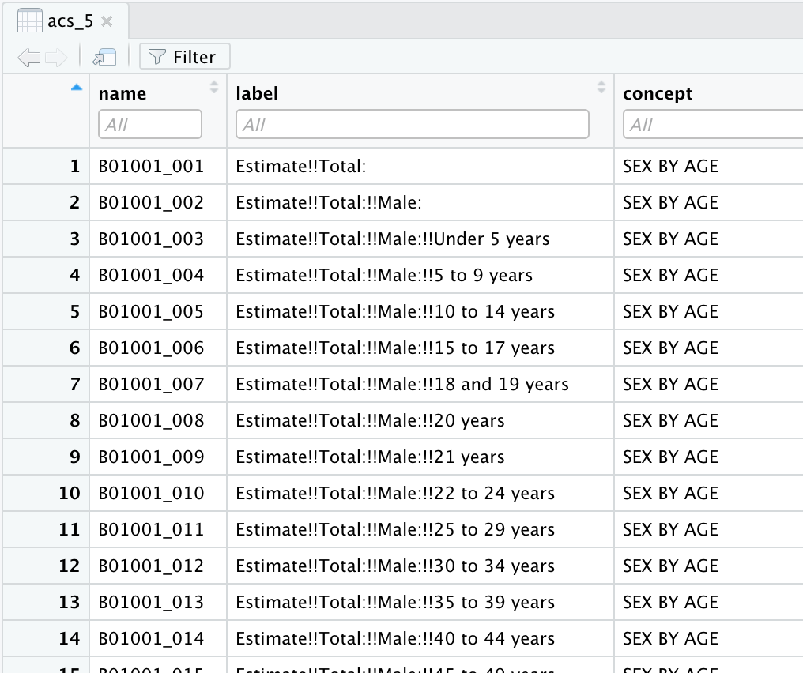

```{r, child="_common.Rmd"}
```

```{r setup, warning=FALSE, tidy=FALSE}
library(tidyverse)        # data manipulation
library(tidycensus)       # access US Census data
library(sf)               # manipulate spatial objects
```

## Overview

In this guide I will provide an overview of how to coordinate US Census demographic information with Twitter status posts collected from the Twitter API that include geolocation information (i.e. latitude and longitude coordinates).

## Access to the US Census

The first step is to acquire a US Census API Key. You can do so by [following this link](https://api.census.gov/data/key_signup.html). Once you have your API key, you will now want to add it to RStudio --but you want to add it to the R environment, not in a script in your project directory. To do this we can run the `tidycensus::census_api_key()` function and use your API key as a character vector as the first argument then set `install = TRUE`.

``` r
tidycensus::census_api_key(key = "<your-api-key-here>", install = TRUE)
```

:::{.tip}
The `install = TRUE` argument will make this API key available across your RStudio sessions.
:::

### Query US Census data

We use the tidycensus package [@R-tidycensus] to query the US Census. In particular we will look at querying the American Community Survey (ACS) data which is a rolling survey over 5 years ("acs5"). To make it easier to find the codes for the various variables that the survey provides, we can acess the variables table with the `load_variables()` function.

```{r load-acs-variables-show, eval=FALSE}
acs_5 <- 
  load_variables(year = 2019, # select last year of 5-year summary
                 dataset = "acs5", # select the dataset
                 cache = TRUE) # cache the results (to speed subsequent queries)

View(acs_5) # view in RStudio editor pane
```

Assigning it to an object and then calling `View()` allows us to peruse the variables and search them with the filter tool in RStudio, as seen in Figure \@ref(fig:acs-variables-graphic).

```{r acs-variables-graphic, echo=FALSE, fig.cap='ACS 5 survey variable codes and descriptions'}

```

<!-- -   B19013_001 - MEDIAN HOUSEHOLD INCOME IN THE PAST 12 MONTHS (IN 2019 INFLATION-ADJUSTED DOLLARS) -->

We use the `get_acs()` function to pull the demographic information. We can specify the state(s) to query and the type of geography (block, tract, county, state) that we want along with the variable(s) that we want. In addition we can pull the geometry of the geography so we can have the geographic limits of these geographies.

Let's use the variable `B19013_001` which is the median household income in the past 12 months for the counties in Arizona. We will also request the geometry of the counties for graphic visualization.

:::{.tip}
`get_acs()` defaults to 2019 ACS 5-year sample.
:::

```{r example-census-acs-query-single-run, include=FALSE}
az_county_sf <- 
  get_acs(state = "AZ", # state
          geography = "county", # census geography
          variables = "B19013_001", # median income
          geometry = TRUE) # get simple features (sf) geography
```

```{r example-census-acs-query-single-show, eval=FALSE}
az_county_sf <- 
  get_acs(state = "AZ", # state
          geography = "county", # census geography
          variables = "B19013_001", # median income
          geometry = TRUE) # get simple features (sf) geography
```

Let's take a look at the structure of the dataset that is returned.

```{r example-census-acs-preview-i}
glimpse(az_county_sf) # preview
```

This dataset has 15 observations corresponding to the 15 counties in Arizona. The columns include the `GEOID`, `NAME` (county name in this case), `variable` (median income), `estimate` (median income values), `moe` (margin of error of the sample), and the `geometry`.

```{r example-census-acs-preview-ii}
az_county_sf %>% 
  slice_head(n = 5)
```

Let's visualize median income in counties in Arizona with `ggplot()` and the `geom_sf()` function.

```{r example-census-acs-plot-i}
az_county_sf %>% 
  ggplot(aes(fill = estimate)) + # mapping
  geom_sf() + # plot the county geometries
  theme_minimal() + # use a minimal ggplot theme
  labs(title = "Arizona: Median income by county", 
       fill = "Median income") # labels
```

We can also query multiple states or variables. Let's look into education which is the `B07009` category. The sample total is `B07009_001` and the estimate of the sample which have less than a high school education is `B07009_002`.

<!-- Variables:
B07009_001 - Total estimate education
B07009_002 - Less than high school
B07009_003 - High school
B07009_004 - Some college
B07009_005 - Bachelors degree
B07009_006 - Graduate or professional degree

B01003_001 - TOTAL POPULATION
 -->

```{r example-census-acs-query-multiple-run, include=FALSE}
az_county_sf <- 
  get_acs(state = "AZ", # state
          geography = "county", # census geography
          variables = c("B07009_001", "B07009_002"), # edu: total, < high school
          geometry = TRUE) # get simple features (sf) geography
```

```{r example-census-acs-query-multiple-show, eval=FALSE}
az_county_sf <- 
  get_acs(state = "AZ", # state
          geography = "county", # census geography
          variables = c("B07009_001", "B07009_002"), # edu: total, < high school
          geometry = TRUE) # get simple features (sf) geography
```

```{r example-census-acs-query-multiple-preview-i}
glimpse(az_county_sf) # preview structure
```

In this dataset we have the same columns as before, yet we have double the observations. This is due to the fact that each variable is by default added in tidy format as seen below.

```{r example-census-acs-query-multiple-preview-ii}
az_county_sf %>% 
  slice_head(n = 5) # preview data frame
```

For variables in which we want may want to compare the particular variable to the variable's total estimate to get a percentage, it is often better to have the data in wide format. We can run a similar query and add the argument `output = "wide"`.

```{r example-census-acs-query-multiple-wide-run, include=FALSE}
az_county_sf <- 
  get_acs(state = "AZ", # state
          geography = "county", # census geography
          variables = c("B07009_001", "B07009_002"), # edu: total, < high school
          geometry = TRUE, # get simple features (sf) geography
          output = "wide") # get wide output
```

```{r example-census-acs-query-multiple-wide-show, eval=FALSE}
az_county_sf <- 
  get_acs(state = "AZ", # state
          geography = "county", # census geography
          variables = c("B07009_001", "B07009_002"), # edu: total, < high school
          geometry = TRUE, # get simple features (sf) geography
          output = "wide") # get wide output
```

```{r example-census-acs-query-multiple-wide-preview-i}
glimpse(az_county_sf) # preview structure
```

In this dataset we have the same number of observations, but additional columns. The estimate (E) and the margin of error (M) appear for each variable.

```{r example-census-acs-query-multiple-wide-preview-ii}
az_county_sf %>% 
  slice_head(n = 5) # preview data frame
```

Now with the multiple variables for education in wide format we can use the total estimate (`B07009_001E`) and the less than high school estimate (`B07009_002E`) to create a percentage of the county's population with less than a high school education. We use our data manipulation skills to do this. I will use the `mutate()` to calculate the percentage and add it to our data frame.

```{r example-census-acs-percent}
az_county_sf <- 
  az_county_sf %>% 
  mutate(perc_less_hs = (B07009_002E / B07009_001E) * 100) # calculate percent of county with less than high school edu

az_county_sf %>% 
  select(!ends_with("M")) %>% # filter out margin of error columns
  slice_head(n = 5) # preview
```

And again we can visualize this information with `ggplot()`.

```{r example-census-acs-plot-ii}
az_county_sf %>% 
  ggplot(aes(fill = perc_less_hs)) + # mapping
  geom_sf() + # plot the county geometries
  theme_minimal() + # use a minimal ggplot theme
  labs(title = "Arizona: Less than high school by county", 
       subtitle = "Percentage",
       fill = "Less than high school") # labels
```

## Twitter

Now let's look at how to join the information from the US Census with Twitter status posts (tweets) with geolocation information (i.e. latitude and longitude coordinates).

### Orientation

As an example, I will read in a dataset collected from the Twitter API via rtweet [@R-rtweet]. The collection includes various regionalisms (faucet, spigot, frying pan, skillet, pail, bucket, coke, pop, soda, you guys, yall). We will focus on the terms "y'all" (and "yall") and "you guys". I will also remove all tweets with no geolocation coordinate information.

```{r tusr-read-dataset, message=FALSE}
typ_df <- 
  read_csv(file = "guide_2/data/derived/tusr_curated.csv") %>% # read dataset
  mutate(user_id = as.character(user_id), # convert to character
         status_id = as.character(status_id)) %>%  # convert to character
  filter(search_term %in% c("yall", "you guys")) %>% # only keep you plural search terms
  mutate(search_term = factor(search_term)) %>%  # make search term a factor
  filter(lat != "") # remove tweets with no geolocation information

glimpse(typ_df) # preview
```

We have `r nrow(typ_df)` observations and `r ncol(typ_df)` variables.

Now let's take a look at the data dictionary for this dataset.

```{r tusr-read-show-data-dictionary, echo=FALSE, message=FALSE}
print_pretty_table <- function(data, caption, n = 10) {
  # Function
  # Print data frames as pretty tables with captions

  data %>% # dataset
    slice_head(n = n) %>% # first n observations
    knitr::kable(booktabs = TRUE, # bold headers
                 caption = caption) # caption
}

read_csv(file = "guide_2/data/derived/tusr_curated_data_dictionary.csv") %>% 
  print_pretty_table(caption = "Data diciontary for the Twitter US regionalisms dataset.")
```

Since we have geolocation coordinates, we can map these using `ggplot()` with a base map from the `map_data()` function. 

```{r tusr-plot}
states_map <- map_data("state") # get US map of states

p <- ggplot() + # base plot
  geom_polygon(data = states_map, # map data
               aes(x = long, y = lat, group = group), fill = "white", color = "black") + # set background/ lines
  labs(title = "Tweets in the USA", subtitle = "Regional terms") + # labels
  theme_minimal()

p + # add to previous base plot
  geom_point(data = typ_df, # tweet data with lat and lng coordinates and languages
             aes(x = lng, y = lat, group = 1, color = search_term), # map lat and lng and color for language names
             alpha = 1/4, size = 1.5) + # transparency and size of points
  labs(color = "Regional terms") # labels

```

Trends towards "Y'all" in the South and eastern metropolitan areas. "You guys" is interspersed with "Y'all" to some degree but appears to be more common in the Mid-West and northern states.

The overlap appears to be quite extensive in some states. Let's look at California in particular and explore how we can associate demographic variables with the tweets emanating from tracts (sub-divisions of counties) in this state.

### US Census

Let's pull the demographic estimates for median income, as an example, for all the tracts in California.

<!--
# B01003_001 - TOTAL POPULATION
# B19013_001 - MEDIAN HOUSEHOLD INCOME IN THE PAST 12 MONTHS (IN 2019 INFLATION-ADJUSTED DOLLARS)
# C15010_005 - FIELD OF BACHELOR'S DEGREE FOR FIRST MAJOR FOR THE POPULATION 25 YEARS AND OVER
-->

```{r acs-query-ca-run, include=FALSE}
ca_tract_sf <- 
  get_acs(state = "CA", # state
          geography = "tract", # census geography
          variables = c("B19013_001"), # median income
          geometry = TRUE) # get simple features (sf) geography
```

```{r acs-query-ca-show, eval=FALSE}
ca_tract_sf <- 
  get_acs(state = "CA", # state
          geography = "tract", # census geography
          variables = c("B19013_001"), # median income
          geometry = TRUE) # get simple features (sf) geography
```

```{r ca-tracts-preview}
glimpse(ca_tract_sf) # preview ACS tracts for CA
```

The dataset has `r nrow(ca_tract_sf)` observations corresponding to the number of tracts in California and `r ncol(ca_tract_sf)` columns --the same we saw earlier for the single variable, tidy version of the ACS query.

For fun, let's plot the census information for tract median income in California.

```{r ca-tracts-plot-i}
ca_tract_sf %>% 
  ggplot(aes(fill = estimate)) + # mapping
  geom_sf() + # plot the county geometries
  theme_minimal() + # use a minimal ggplot theme
  labs(title = "California: Median income by tract", 
       fill = "Median income") # labels
```

Now let's add the appropriate CRS (coordinate reference system) scheme to the `lng` and `lat` variables in the tweet dataset (`typ_df`). We use the `st_as_sf()` function to do this. 'sf' stands for spatial features object and we map the `lng` and `lat` to `coords` and set the `crs` to the CRS of the `ca_tract_sf` object.

```{r typ-add-sf-crs}
typ_sf <- 
  typ_df %>% # original dataset
  st_as_sf(coords = c("lng", "lat"), # map x/long, y/lat values to coords
           crs = st_crs(ca_tract_sf)) # align coordinate reference systems

glimpse(typ_sf) # preview
```

We now see that our data frame has converted the latitude and longitude to a geometry vector. We can now use the `st_join()` function to associate those geolocation points from our tweet data with the demographic information from the US Census.

```{r typ-census-join}
typ_census_sf <- 
  st_join(typ_sf, ca_tract_sf) # join tweets and census by geometry

glimpse(typ_census_sf) # preview
```

We have combined the tweets and census data resulting in `r nrow(typ_census_sf)` observations. Notice, however, that there are various observations with `NA` values. These are tweets that do not emanate from within California. So we can eliminate them from the dataset for our purposes here.

```{r typ-census-ca}
typ_census_ca_sf <- 
  typ_census_sf %>% 
  filter(GEOID != "") # keep observations with GEOIDs

glimpse(typ_census_ca_sf) # preview
```

After filtering out tweets not originating from California we now have `r nrow(typ_census_ca_sf)` observations.


## References

```{r us-states, eval=FALSE, include=FALSE}
join_tweets_to_states <- function(tweets) {
  # Function
  # Takes a data frame result from an rtweet::search_term() query
  # and maps the tweets with lat/lng values to US states
  # 
  # Requires a US Census API Key: https://api.census.gov/data/key_signup.html
  # that is added to the .Renviron file with tidycensus::census_api_key()
  
  library(tidyverse, quietly = TRUE) # data manipulation
  library(tidycensus)                # us state geometries
  
  # Get the spatial geometries for each US state/ territory
  states_sf <- 
    get_acs(geography = "state", # states
            variables = "B01003_001", # total population
            geometry = TRUE) %>% # spatial geometry
    select(state_name = NAME, geometry) # only keep state name and geometry columns
  
  # Align the CRS for tweets to the census
  tweets_sf <- 
    tweets %>% # original data frame
    filter(lat != "") %>% # only keep tweets with lat/lng values
    st_as_sf(coords = c("lng", "lat"), # map x/long, y/lat values to coords
             crs = st_crs(states_sf)) # align coordinate reference system
  
  # Map tweet coords to census state geometries
  tweets_states_sf <- 
    st_join(tweets_sf, states_sf) 
  
  tweets_states_df <- 
    tweets_states_sf %>% # spatial features object
    as_tibble() %>% # convert to tibble (remove spatial features)
    filter(state_name != "") # keep only US states/ territories
  
  return(tweets_states_df) # return the final data frame
  
}

typ_states_df <- join_tweets_to_states(tweets = typ_df)

census_region <- read_csv(file = "guide_2/data/census_regions.csv")

typ_states_region_df <- 
  left_join(typ_states_df, census_region) # associate regions with states

typ_states_region_df %>% 
  ggplot(aes(x = census_region, fill = search_term)) + # mappings
  geom_bar(position = "fill") # geometry, with fill for proportion plot

typ_states_region_tab <- 
  xtabs(~census_region + search_term, data = typ_states_region_df)

c1 <- chisq.test(typ_states_region_tab)

c1$p.value < .05 # check p-value threshold

effects <- effectsize::effectsize(c1) # assess the effect size and confidence interval

effects # view

effectsize::interpret_r(effects$Cramers_v) # interpret the effect size

```
