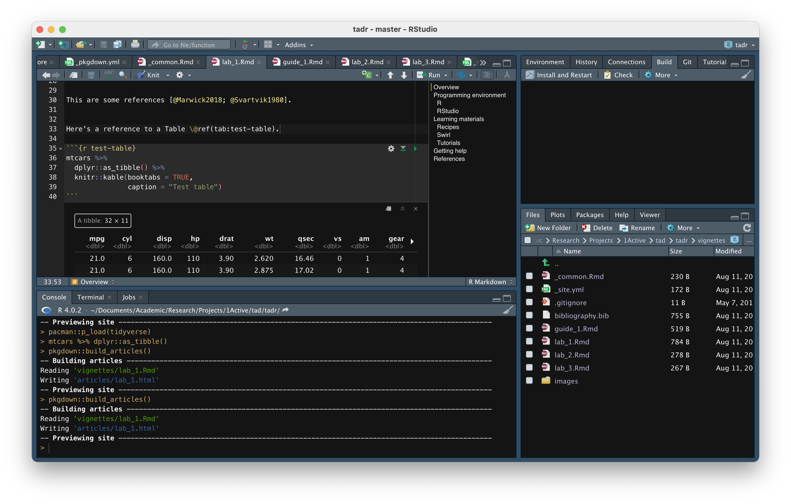

```{r, child="_common.Rmd"}
```

```{r setup, include=FALSE}
pacman::p_load(tidyverse) 
```

## Overview

In this Recipe, I will outline an powerful technology for creating reproducible analysis. 

Test figure Figure \@ref(fig:test-figure).

```{r test-figure, fig.cap='Test figure'}
mtcars %>% 
  ggplot(aes(x = mpg, y = drat)) +
  geom_point()
```


This are some references [@Marwick2018; @Svartvik1980].


Here's a reference to a Table \@ref(tab:test-table).

```{r test-table}
mtcars %>% 
  dplyr::as_tibble() %>% 
  knitr::kable(booktabs = TRUE, 
               caption = "Test table")
```
Here is an image. 

```{r test-image}

```


## Programming environment

### R

Information about R

### RStudio

## Learning materials

### Recipes

### Swirl

### Tutorials

## Getting help

- ...

## References


