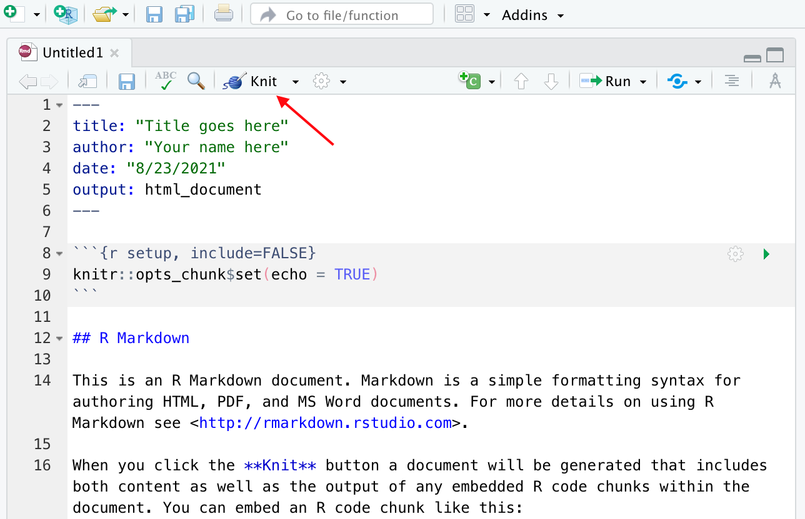

```{r, child="_common.Rmd"}
```

```{r setup, include=FALSE}
knitr::opts_chunk$set(echo = TRUE)
```

## Overview

In this Recipe we will introduce the concept of Literate Programming and describe how to implement this concept through R Markdown. I will provide a demonstration of some of the features of R Markdown and describe the main structural characteristics of an R Markdown document to help you get off and running!

## Literate Programming

First introduced by Donald Knuth [@Knuth1984], the aim of Literate Programming is to be able to combine computer code and text prose in one document. This allows an analyst the ability to both run code, view the output of the code, view the code itself and provide prose description all in one document. In this way, a literate programming document allows for presenting your analysis in a way that performs the computing steps desired and presents it in an easily readable format. Literate programming is now a key component of creating and distributing reproducible research [@Gandrud2015].


## R Markdown

[R Markdown](https://rmarkdown.rstudio.com/) is a specific implementation of the literate programming paradigm. In Figure \@ref(fig:image-rmarkdown-preview) we see an example of R Markdown in action. In on the left we see the R Markdown source document and on the right the output (in HTML) generated by this source document. 

```{r image-rmarkdown-preview, echo=FALSE, fig.cap='R Markdown source and output example.'}

```

R Markdown documents generate various types of output: web documents (.html), PDFs, Word documents, and many other types of output formats. While the interleaving of code and prose is one of the most attractive aspects of literate programming and R Markdown, it is also possible to create documents with no code at all. It is a very versatile technology as you will come to appreciate. If you would like to see some R Markdown in action please check out the [Gallery on the R Markdown website](https://rmarkdown.rstudio.com/gallery.html).

*Note: Throughout these Recipes you can view the source R Markdown document that created the recipe you are reading by following the link at the top of the page.*

```{r image-link-to-source-rmd, echo=FALSE}

```

An R Markdown source document is a plain-text file with the extension `.Rmd` that can be opened in any plain text reader. We will be using the RStudio IDE^[IDE stands for "Integrated Development Environment.] (henceforth RStudio) to create, open, and edit, and generate output from `.Rmd` files but any plain-text reader, such as TextEdit (MacOS) or Notepad (PC) can open these files. 

With this in mind, let's now move on to the anatomy of an R Markdown document.

### Structure

At the most basic level an R Markdown document contains two components: (1) a front-matter section and (2) a prose section. A third component, a code chunk, can be interleaved within the prose section to add code to the document. Let's look at each of these in turn. 

##### Front matter

The front matter of an R Markdown document appears, well, at the front of the document (or the top, rather). Referring back to Figure \@ref(fig:image-rmarkdown-preview) we see the front matter at the top.   

```yaml
---
title: "Introduction to R Markdown"
author: "Jerid Francom"
date: "8/23/2021"
output: html_document
---
```

When creating an R Markdown document with RStudio the default attributes are `title`, `author`, `date`, and `output`. The front matter is bounded by three dashes `---`. 

The values for the first three attributes are pretty straightforward and can be edited as needed. The value for the `output` attribute can also be edited to tell the `.Rmd` file to generate other output types. Can you guess what value we might use to generate a PDF document? Yep, it's just `pdf_document`. As we work R Markdown you will learn more about how to use the RStudio interface to change some of these attributes and add others!

##### Prose

Any where below the front matter and not contained within a code chunk is open for prose. The prose section(s) have an added functionality in that they are Markdown aware. What does that mean, you say? Well, the 'Markdown' in R Markdown refers to the fact that we can use various plain-text formatting conventions to produce formatted text in the output document. To quote [Wikipedia](https://en.wikipedia.org/wiki/Markdown)

> Markdown is a lightweight markup language for creating formatted text using a plain-text editor. John Gruber and Aaron Swartz created Markdown in 2004 as a markup language that is appealing to human readers in its source code form. Markdown is widely used in blogging, instant messaging, online forums, collaborative software, documentation pages, and readme files.

What this enables us to do is to add simple text conventions to signal how the output should be formatted. Say we want to make some text **bold**. We just add `**` around the text we want to appear bold. 

```
**bold text**
```

We can also do: 

- *italics* `*italics*`
- [links](http://wfu.edu) `[links](http://wfu.edu)`
- ~~strikethrough~~ `~~strikethrough~~`
- *etc.*

Follow [this link find more information on basic Markdown syntax](https://rmarkdown.rstudio.com/authoring_basics.html).

#### Code chunks

Code chunks are where the R magic happens. Again, referring to Figure \@ref(fig:image-rmarkdown-preview) we see that there is the following code chunk.


````
```{r cars}`r ''`
summary(cars)
```
````

A code chunk is bound by three backticks `` ``` ``. After the first backticks the curly brackets `{}` allow us to tell R Markdown which programming language to use to evaluate (i.e. run) in the code chunk. In most cases this will be R, hence the the opening curly bracket `` `{r}` ``. It is good practice to name your code chunk(s). In this case we have `` `{r cars}` ``. After this line and before the closing curly brackets is where our code will be entered. In this example, the R function (command) `summary()` is used on the dataset `cars` to produce a summary of the dataset. Here's what this code chunk produces. 

```{r cars}
summary(cars)
```

We have only mentioned selecting the coding language and naming the code chunk, but [code chunks have various other options](https://rmarkdown.rstudio.com/lesson-3.html) that can be used to determine how the code chunk should be used. Some common code chunk options are:

- hiding the code

````
```{r cars, echo=FALSE}`r ''`
summary(cars)
```
````

```{r, echo=FALSE}
summary(cars)
```

- hiding the output

````
```{r cars, include=FALSE}`r ''`
summary(cars)
```
````

```{r, include=FALSE}
summary(cars)
```

- *etc.*

### Create and render

The easiest and most efficient way to create an R Markdown file is to use the RStudio point-and-click' interface. Just use the tool bar to create a new file and select "R Markdown", as seen in Figure \@ref(fig:image-toolbar). 

```{r image-toolbar, echo=FALSE, fig.cap='Create an R Markdown document with the RStudio toolbar.'}
knitr::include_graphics("images/recipe_1/toolbar.png")
```

This will provide you a dialogue box asking you to add a title and author to the document and also allows you to select the type of document to output. 

```{r image-create-rmarkdown-dialogue, echo=FALSE, fig.cap='RStudio dialogue box for creating an R Markdown document.'}
knitr::include_graphics("images/recipe_1/create-rmarkdown-dialogue.png")
```

On clicking 'OK' you will get an R Markdown document with some default/ boilerplate prose and code chunks. These can be deleted and we can start our own document. But for now, let's leave things as they are and see how to generate the output report from this document. 

To generate an output report is to 'render' the document, or even 'knit' the document. This is because we use the `render()` function from the `knitr` package. Leaving functions and packages aside we can knit an R Markdown document from the RStudio toolbar by clicking 'Knit', as seen below.

```{r graphic-knit-rmarkdown, echo=FALSE, fig.cap='Knit and R Markdown document from the RStudio toolbar.'}

```


Before it will render, you will be asked to save the file and give it a name. Once you have done that the `.Rmd` file will render in the format you have specified and open in the 'Viewer' pane. 

## Summary

This concludes our introduction to literate programming using R Markdown. We have covered the basics here but there is much more to explore. We will introduce more R Markdown functionality in the next Recipe but if you would look ahead and explore other features I recommend reading over the [R Markdown (Get Started series)](https://rmarkdown.rstudio.com/lesson-1.html). For a deeper dive, or for reference visit [R Markdown: The Definitive Guide](https://bookdown.org/yihui/rmarkdown/) [@Xie2018]

## References


