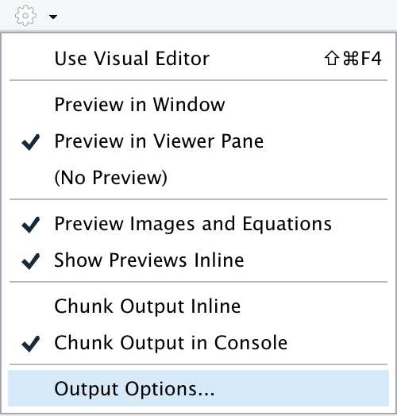
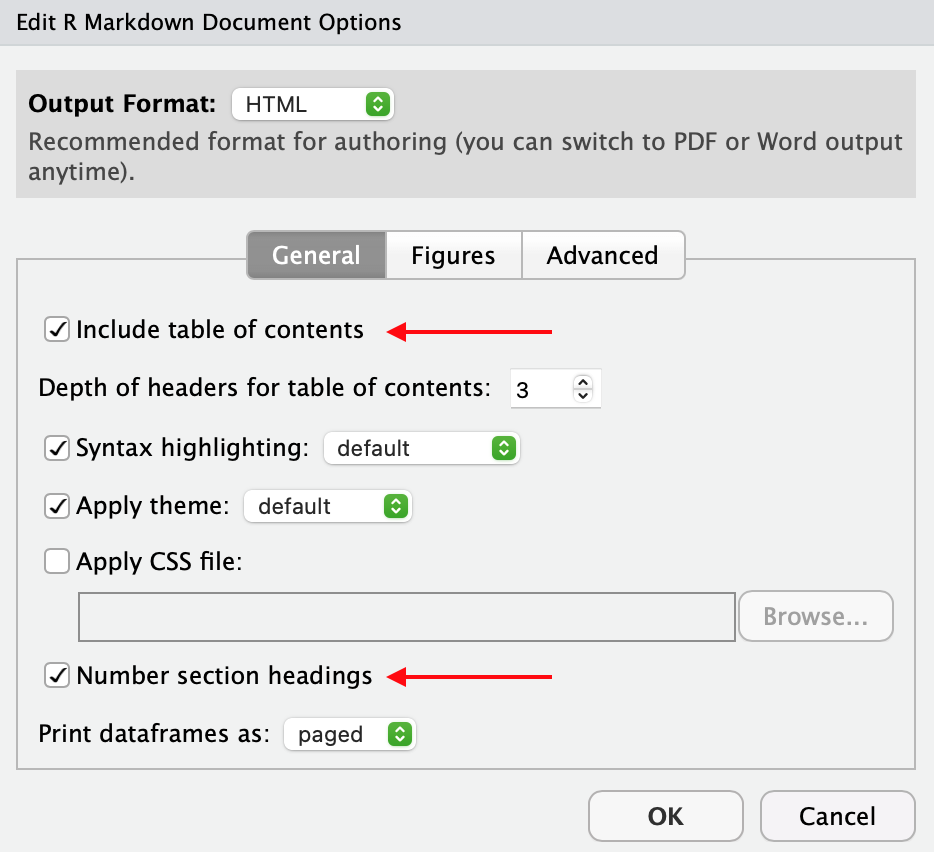
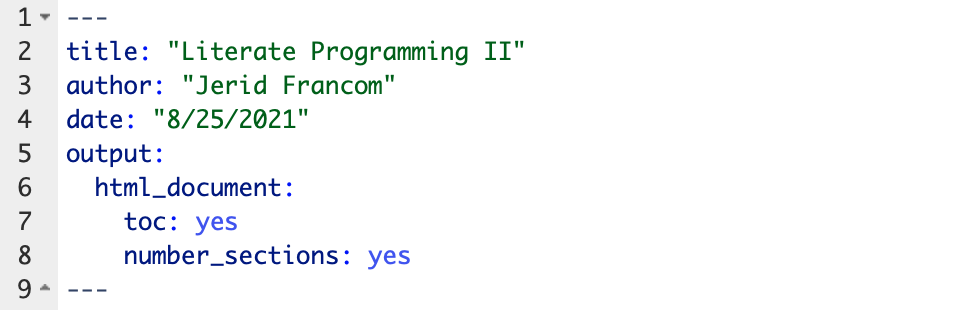
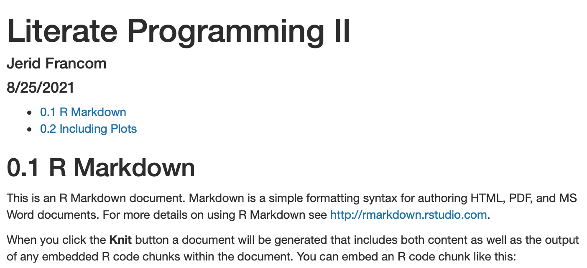
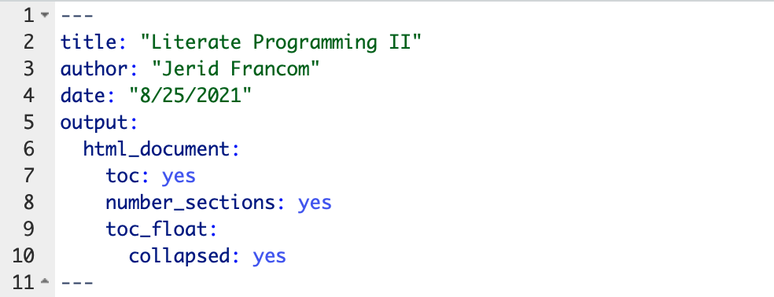
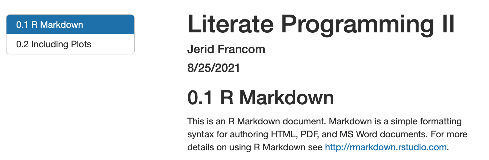
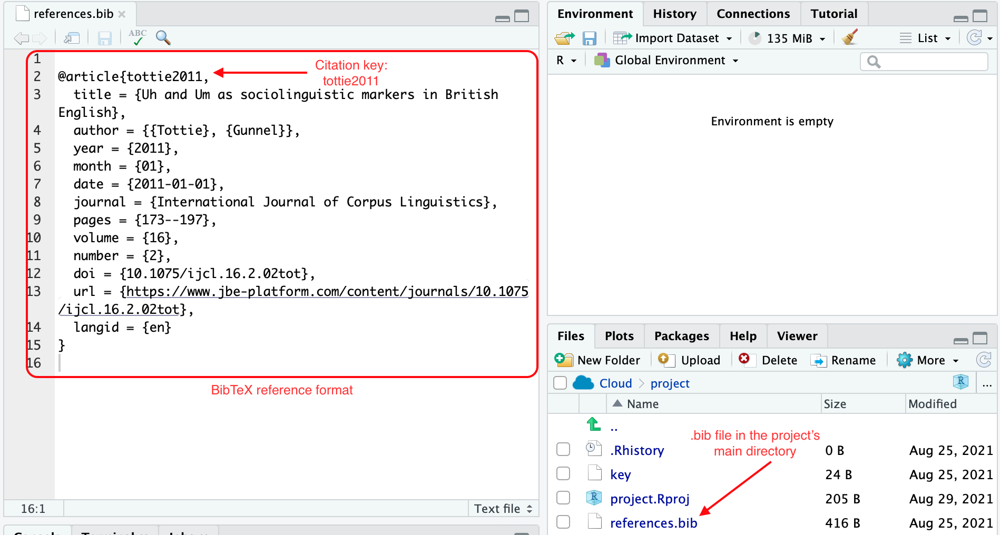
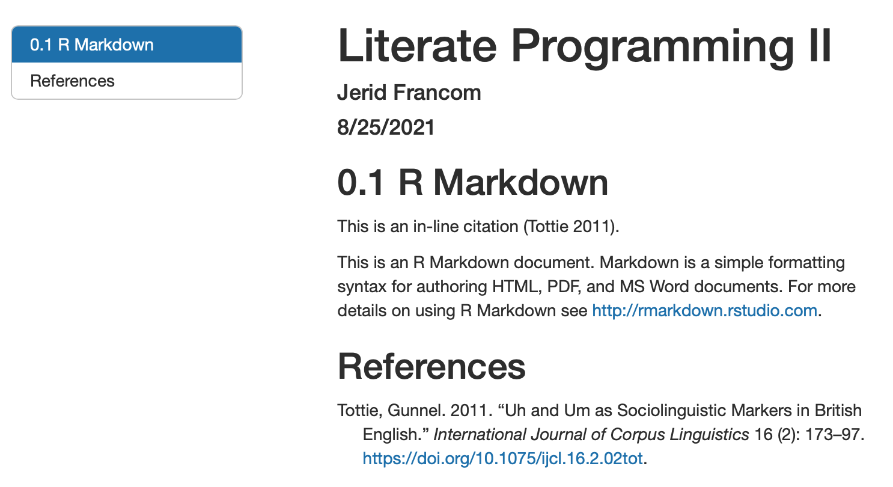

```{r, child="_common.Rmd"}
```

```{r setup, include=FALSE}
knitr::opts_chunk$set(echo = TRUE)
```

## Overview

In this Recipe we are going to explore additional functionality in R Markdown. This will include how to number sections, add a table of contents, how to add in-line citations and a document-final references list, and cross-reference tables and figures. 

## Toolbar options

Let's explore some of the functionality that RStudio provides quick access to through the toolbar. In the RStudio toolbar to the right of the 'Knit' button, there is a cog icon. Click the dropdown menu from this icon and select 'Output Options...', as seen in Figure \@ref(fig:image-output-options). 

```{r image-output-options, echo=FALSE, fig.cap="RStudio 'Output Options...'.", out.width='25%'}

```

A dialogue box will open (Figure \@ref(fig:image-document-options)). This dialogue box, provides the option to add a document output type to the front matter (of the three principle types --HTML, PDF, and Word) and/ or modify the output type options. Looking at the general options for HTML, we can add a table of contents, change theme colors (for code syntax and general), and add numbers to section headings (among other options). 

```{r image-document-options, echo=FALSE, fig.cap='RStudio toolbar document options.', out.width='50%'}

```

If we check "Include table of contents" and "Number section headings" and click "OK", you will see that the front matter is modified by RStudio --specifically, the last four lines.

```{r image-front-matter-toc-num-headings, echo=FALSE, include=FALSE, fig.cap='Front matter with table of contents and numbered section headings added with RStudio'}

```

```yaml
---
title: "Literate Programming II"
author: "Jerid Francom"
date: "8/25/2021"
output: 
  html_document: 
    toc: yes
    number_sections: yes
---
```

Now if we 'Knit' the R Markdown document it will look like this. 

```{r image-output-toc-num-headings, echo=FALSE, fig.cap='HTML output with table of contents and numbered section headings.'}

```

There is nothing magical about what RStudio has done. We could have changed the front matter manually to include this functionality, as we will see in the next section. The toolbar, however, does provide convenient access to some of the most common options and is a great way to get started modifying R Markdown front matter.

## Manual options

The options provided in the RStudio toolbar are some of the most commonly used of the many potential attributes you can use to modify an R Markdown document's output. A good first resource for exploring these options and other functionality not accessible through the RStudio toolbar is [R Markdown: The Definitive Guide](https://bookdown.org/yihui/rmarkdown/) [@Xie2021a]. The section on Output Formats provides descriptions of attributes and values for many output types. 

Let's look at the [HTML document section for Table of contents output options](https://bookdown.org/yihui/rmarkdown/html-document.html#table-of-contents). Here we can see that we can manually add to the front matter seen in specifying what level of header depth to include (`toc_depth:`) and if we want to have the table of contents positioned floating to the left of the document (`toc_float:`), as well as how a floating table of contents should behave. 

To add these options to the R Markdown document manually, we need to make sure to tab-indent the attribute under the appropriate attribute it modifies. So, to add a table of contents to our `html_document:` attribute, the `toc:` attribute is tab-indented under `html_document:`. The value it takes, if we want it to appear is `true` or `yes` (either will work). Floating a table of contents also modifies the `html_document:` attribute, and is also tab-indented in the same fashion. If, however, we want to modify how the table of contents floats (say, to have the table of contents 'collapsed' by default), then these attributes need to be tab-indented relative to the `toc_float:` attribute. The configuration just described is shown below.

```{r image-front-matter-toc-float, echo=FALSE, include=FALSE, fig.cap='Front matter with added floating table of contents, collapsed by default.'}

```

```yaml
---
title: "Literate Programming II"
author: "Jerid Francom"
date: "8/25/2021"
output: 
  html_document: 
    toc: yes
    number_sections: yes
    toc_float:
      collapsed: yes
---
```

Now if we 'Knit' the R Markdown document with these new attribute/ value pairs it will look like this. 

```{r image-output-toc-float, echo=FALSE, fig.cap='HTML output with added floating table of contents.'}

```

*A very important note: not all output formats have the same available options, by simple nature of the type of output document. For example, a floating table of contents makes sense for HTML output, but does not for PDF or Word documents. So be mindful of the output format you are using and the options that are available.*

## Advanced options

There are many other options to explore. A good resource to explore for more advanced functionality is [R Markdown Cookbook](https://bookdown.org/yihui/rmarkdown-cookbook/) [@Xie2021]. In this resource we find information that will be very useful for creating research reports: [bibliographies and citations](https://bookdown.org/yihui/rmarkdown-cookbook/bibliography.html) and [cross-referencing within documents](https://bookdown.org/yihui/rmarkdown-cookbook/cross-ref.html).

### Bibliographies and citations

The ability to add citations and references to an R Markdown document is a very useful option for documenting literature for a report. There are three things that an R Markdown document needs to be able to include in-line citations and a document-final references section. 

1. A bibliography file in `.bib` (BibTeX) format in the project's main directory (folder)
2. The `bibliography:` attribute with a value specifying the name of the `.bib` file in the front matter
3. An inline citation which includes the citation key for the reference from the `.bib` file in any part of the prose section

Let's take each of these elements in turn. First, a `.bib` file is just a plain text file with the `.bib` extension. In this file, a reference's key information is formatted according to the BibTeX format and includes a citation key. 

```{r image-bibtex-file, echo=FALSE, fig.cap='The bibliography file (.bib) and format.'}

```

Next we add a `bibliography:` attribute with the name of our `.bib` file as the value. This attribute is not indented.

```yaml
---
title: "Literate Programming II"
author: "Jerid Francom"
date: "8/25/2021"
output: 
  html_document: 
    toc: yes
    number_sections: yes
    toc_float:
      collapsed: yes
bibliography: references.bib
---
```

Finally, we make reference to the citation key in the `.bib` file in the prose of our R Markdown document using an in-line citation. The citation key always includes the `@citation-key` format. To include the citation in parentheses, we add brackets around the citation key `[@citation-key]`. So for our example reference we use the citation key `tottie2011`, and include it in the prose like this:

```
## R Markdown

This is an in-line citation [@tottie2011].
```

Knitting this document then produces the in-line citation and adds the full reference at the end of the document. Notice I've added a section header 'References' at the end of the R Markdown document so that the references appear underneath. 


```{r image-output-citation-reference, echo=FALSE, fig.cap='HTML output with an in-line citation and full reference.'}

```

Now to manage references, get the BibTeX format, and add it to a `.bib` file in RStudio Cloud we will use [Zotero](https://www.zotero.org). In the following video I describe the process to set up and use Zotero in RStudio Cloud (length 22:02 minutes). 

<p align="center">
<iframe width="560" height="315" src="https://www.youtube.com/embed/gngJ86WCiXA" title="YouTube video player" frameborder="0" allow="accelerometer; autoplay; clipboard-write; encrypted-media; gyroscope; picture-in-picture" allowfullscreen></iframe>
</p>


### Cross-referencing within documents

Another useful feature for reports is the ability to reference tables and graphics in an R Markdown document, as seen in Figure \@ref(fig:image-output-cross-references). 

```{r image-output-cross-references, echo=FALSE, fig.cap='HTML output with figure and table cross-references.'}
knitr::include_graphics("images/recipe_2/output-cross-references.png")
```

The standard R Markdown document outputs (`html_document`, `pdf_document` and `word_document`) do not provide this functionality. To be able to create cross-references, we need to use the `bookdown` package. If it is not already installed, we need to do that first in the R Console. 

```r
# install the bookdown package
install.packages("bookdown")
```

*Note: In the LIN 380 workspace on RStudio Cloud, `bookdown` is already installed.*

Then, we need to edit the front matter to make use of the document outputs `html_document2`, `pdf_document2` and `word_document2`. The output formats need to make reference to the package directly, so we include `bookdown::html_document2`, as seen below.

```yaml
---
title: "Literate Programming II"
author: "Jerid Francom"
date: "8/25/2021"
output: 
  bookdown::html_document2: 
    toc: yes
    number_sections: yes
    toc_float:
      collapsed: yes
bibliography: references.bib
---
```

Next we need to find the code chunk name that we will make reference to and make sure that there is a caption associated with the figure or table. In the example code below, the code chunk name is `cars-figure` and the code chunk option `fig.cap=''` is added with the caption between the quotes. 


````
```{r cars-figure, fig.cap='Example plot'}`r ''`
plot(cars)
```
````

For a table, again, we find the code-chunk name (`cars-table`) and make sure there is a caption associated. Captions for tables, however, is not part of the code chunk options, but rather the function that creates the table needs to add the caption. In the example below, I've used the `kable()` function from the `knitr` package (referenced directly with `knitr::kable()`). One of the arguments of the `kable()` function is `caption = `. 

````
```{r cars-table}`r ''`
knitr::kable(head(cars), caption = "Example table.")
```
````

Now we have our ducks in a line. To have the cross-reference appear in-line, we use the following format: 

- For figures: `\@ref(fig:code-chunk-name)`
- For tables: `\@ref(tab:code-chunk-name)`

To to make reference to our example plot with the code chunk name `cars-figure`, the in-line reference would be `\@ref(fig:cars-figure)`. And for the table `cars-table`, `\@ref(tab:cars-table)`. This will automatically generate the figure and table numbers, and only the numbers, in the order they appear in the R Markdown document. Just add 'Figure' or 'Table' before to have the reference appear as seen in Figure \@ref(fig:image-output-cross-references) above.

As I mentioned earlier, `bookdown` also has cross-reference enabled `pdf_document2` and `word_document2`. This allows us to create PDF and Word documents with cross-referencing as well. 

```yaml
---
title: "Literate Programming II"
author: "Jerid Francom"
date: "8/25/2021"
output: 
  bookdown::pdf_document2: 
    toc: yes
    number_sections: yes
bibliography: references.bib
---
```

*Note: the attributes associated with a floating table of contents have been removed from the `pdf_document2` output as they are not applicable to PDF documents. The same is the case for `word_document2`.*

## Summary

In this Recipe I introduced a variety of features that we can add to R Markdown documents to help us generate informative reports. This included how to number sections, add a table of contents, how to add in-line citations and a document-final references list, and how to cross-reference tables and figures.

In the next Recipe we will turn out attention to working with R. We will continue to use R Markdown, however, as our vehicle to interleave R code and prose description so we will continue to work with and extend the knowledge we have gained in these first two Recipes on Literate Programming in R Markdown.

## References
