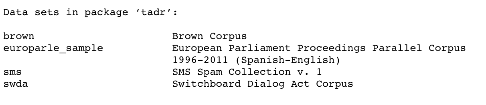
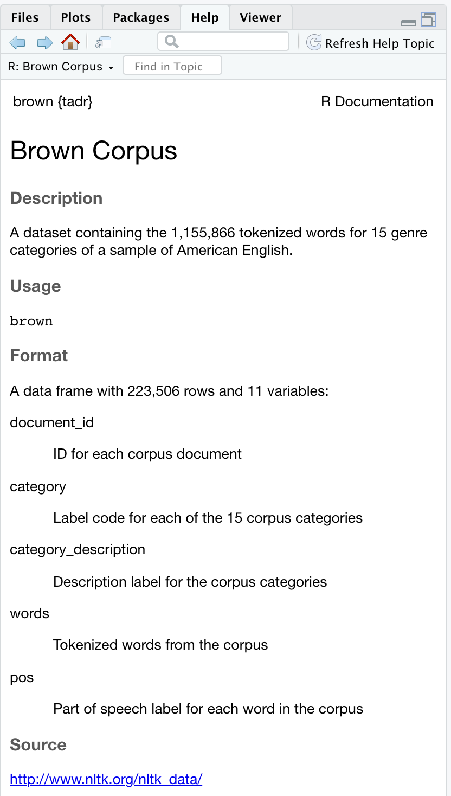

```{r, child="_common.Rmd"}
```

## Overview

In this Recipe we will now start to turn our focus to using literate programming in R markdown to work with R coding strategies. This means we will make more extensive use of 'code chunks'. This is where actual R code will be entered, the work will be done, and when output from the R code returns some value, table, or graphic, it will appear in our document output.

Here we will focus on reading, inspecting, and writing data.

## Setup

Before we get work, let's do some housekeeping to set up our R Markdown document for the type of work we are going to be doing. First, it is common to include a code chunk at the top of the prose section. We will use this code chunk to load the necessary R packages that have functions that we will use extensively through the document. It can also be used for other various settings that affect code execution or display document-wide.

It is typical to name this chunk 'setup' and add the code-chunk option-value pair `message=FALSE` to suppress some of the message information that is typically returned when loading packages.

    ```{r setup, message=FALSE}`r ''`
    # Load packages
    library(tidyverse) # for general data manipulation
    ```

So I'm going to load the tidyverse package that we will use extensively in this Recipe, and almost every Recipe.

```{r load-packages}
# Load packages
library(tidyverse) # for general data manipulation
```

::: {.tip}
If we want to use a function from a package once or sporadically, we can also reference the function with the `package::function()` syntax to access the function without having to load it with `library()` function.
:::

Second, in this Recipe many of the code chunks will return tabular data (data.frame or tibble). By default, tabular format will look like this:

```{r iris-default, render=print.data.frame}
slice_head(iris, n = 5)
```

To have the output of the tabular data show up in a pretty, human-readable format across the entire document we can also add the `df_print: kable` attribute-value pair to our front-matter under the output document type.

``` {.yaml}
---
title: "Recipe #3"
author: "Jerid Francom"
date: "9/3/2021"
output: 
  html_document: 
    df_print: kable
---
```

Now the output of code chunk that returns a data.frame or tibble will appear like this:

```{r iris-kable}
slice_head(iris, n = 5)
```

## Working with data

With our setup in place, let's now turn to reading, inspecting, and writing data! In this Recipe we will focus on working with datasets, that is, data that is in a relational, tabular format.[^1]

[^1]: We will work with data in other formats later in this Recipe series.

### Reading data

Datasets can be read into an R session and assigned to an object from various sources: package data, local data, or remote data. Let's look at each of these in turn.

#### Package data

Some packages will either include data in combination with a set of functions or may be dedicated solely to making data accessible. A list of all the data for packages (currently) installed can be accessed by running `data()` in the R console. If you want to explore the data within a particular package you can run the same function with the argument `package =` and the name of the package in quotes. In Figure \@ref(fig:image-tadr-datasets) we see the datasets included in the tadr package (this is the Text as Data Resources package).

```{r reading-package-data, eval=FALSE}
data() # view datasets for all installed packages
data(package = "tadr") # view datasets for the tadr package
```

```{r image-tadr-datasets, echo=FALSE, fig.cap='Viewing the datasets in the tadr package.'}

```

Once you've identified a package with data you would like to explore, you can either load the package with `library()` and then enter the name of the data object or use the `package::dataset-name` convention to skip loading the package into the R session. In either case, it is always a good idea to find out more about the data before outputting the object contents to an R Markdown document or in the R Console. We can do this by simply adding `?` before the object name to bring up the R documentation for the data.

``` {.r}
library(tadr) # load the package into the R session
?brown # view the R documentation
```

``` {.r}
?tadr::brown # view the R documentation, without loading the package into the R session
```

Either approach will bring up the R documentation in the 'Help' pane in RStudio, as seen in Figure \@ref(fig:image-tadr-documentation).

```{r image-tadr-documentation, echo=FALSE, out.width='50%', fig.cap='R documentation for the `brown` dataset from the tadr package.'}

```

Looking at the `brown` dataset in the R documentation, we see that if we were to simply call `brown` at the R Console or by knitting an R Markdown document, we would get a table with 223,506 rows!

::: {.tip}
If we have loaded the library that contains the data, then we can then just use the object's name to access the data. If in the case where we have only explored the data, without loading the package (`package::dataset-name`), then it is often best to now load the library to have direct acess to the data and the data documentation in R.
:::

#### Local data

Packages often contain datasets for demonstration purposes, but datasets used in research are often stored on your computer (or your cloud computer!). This data is considered 'local'. There are [many formats for storing local data](https://en.wikipedia.org/wiki/File_format). We will start with the most accessible format for tabular data the [delimited-text file](https://en.wikipedia.org/wiki/Delimiter-separated_values). In this type of dataset format the delimiter is typically a comma or tab space giving the most common delimited-text files their names: [comma-separated values (csv)](https://en.wikipedia.org/wiki/Comma-separated_values) and [tab-separated values (tsv)](https://en.wikipedia.org/wiki/Tab-separated_values). The delimiter marks columns (variables) and new lines denote new rows (observations).

```{r generate-delimited-file-structure, echo=FALSE}
delim_dataset <- 
  tribble(
  ~column_1, ~column_2, ~column_3,
  "value", "value", "value",
  "value", "value", "value"
)

write_csv(delim_dataset, file = "recipe_3/data/delim_example.csv")
write_tsv(delim_dataset, file = "recipe_3/data/delim_example.tsv")
```

CSV file example

    column_1,column_2,column_3
    value,value,value
    value,value,value

TSV file example

    column_1    column_2    column_3
    value   value   value
    value   value   value

These file formats can become difficult for a human to read in their native format, but once they are read into memory in a programming language or piece of software, they are more human-friendly.

```{r delim-file-human, echo=FALSE}
delim_dataset
rm(delim_dataset)
```

The advantage to working with delimited-text files is that they are plain-text files which means they are easy to share and are widely supported in programming languages (R, Python, etc.) and open-source (OpenOffice) and proprietary software (MS Office).

```{r copy-readtext-files, eval=FALSE, echo=FALSE}
# CSV
system.file("extdata/", package = "readtext") %>% 
  fs::dir_ls(recurse = 2, regexp = "csv", type = "directory") %>% 
  fs::dir_copy("recipe_3/data/csv/")

# TSV
system.file("extdata/", package = "readtext") %>% 
  fs::dir_ls(recurse = 2, regexp = "tsv", type = "directory") %>% 
  fs::dir_copy("recipe_3/data/tsv/")
```

So how do we read a local csv or tsv file into R? There are a multitude of ways to read delimited-text files into an R session. Here we will use the aptly named `read_csv()` and `read_tsv()` functions from the readr package [@R-readr], which is part of the tidyverse meta package [@tidyverse2019] which we already loaded earlier in this recipe!

If we inspect these functions (using the `?` before the function name in the R Console), we see that both have only one required argument, `file`. The value for the `file` argument is a path to the file that we want to read. The a path can be understood as a file's address. By default when working with an R Markdown document, a file's path is the directory structure relative to where the R Markdown document is saved. So, if I graphically show the directory structure for this recipe, we see that the path from `recipe_3.Rmd` to the `inaugCorpus.csv` file is: `data/csv/inaugCorpus.csv`.

``` {.bash}
├── recipe_3.Rmd
└── data/
    ├── csv/
    │   └── inaugCorpus.csv
    └── tsv/
        └── dailsample.tsv
```

Let's then add this path as the value of the `file` argument of the `read_csv()` function and assign the result to `inaug_corpus`.

```{r read-csv-no-eval, eval=FALSE}
# read local 'inaugCorpus.csv' file
inaug_corpus <- read_csv(file = "data/csv/inaugCorpus.csv")
```

```{r read-csv-eval, echo=FALSE}

inaug_corpus <- read_csv(file = "recipe_3/data/csv/inaugCorpus.csv")
```

That's all we need to read a delimited-text file into R. The contents of the file are now contained in the `inaug_corpus` object.

#### Remote data

In addition to reading delimited-text files locally, we can also read files that are stored on the internet. All we need is a web path, otherwise known as a URL (Uniform Resource Locator). Datasets in delimited-text files (and other data storage format files) can be commonly found at data repository sites which are dedicated to storing data and making it accessible to the (research) community.

Let's take for example the [ACTIV-ES Corpus](https://github.com/francojc/activ-es) which is available on [GitHub](https://github.com/). This corpus is available in corpus and wordlist forms. If, for example, we want to read the word frequency list for this corpus we can find and copy the link to the `aes1grams.csv` file. Then we use the same `read_csv()` function with the URL as the value for the `file` argument.

```{r read-actives-unigrams}
# read the 'aes1grams.csv' file from github
aes_unigrams <- read_csv(file = "https://github.com/francojc/activ-es/raw/master/activ-es-v.02/wordlists/plain/aes1grams.csv") 
```

Now the contents of the `aes1grams.csv` file are contained in our R session in the `aes_unigrams` object.

### Inspecting data

At this point we are able to read datasets into an R session from packages and local and remote delimited-text files. The next step is to inspect datasets. For package datasets, we already saw that we can use the `?` operator to get an overview of the dataset viewing the R documentation. But for package data and for data we read from local or remote files nothing beats getting into the data and inspecting the data ourselves.

To see the objects that we have read into memory we use the `ls()` function.

```{r list-objects-i}
ls() # list objects
```

The `brown` dataset from the tadr package does not appear because we did not load it into the R session. To do this we load the tadr package and call the `data()` function with `brown` as the only argument.

```{r load-dataset-from-package}
library(tadr) # load tadr package
data(brown) # read brown dataset into our R session
```

Now if we run `ls()` the `brown` dataset will appear as an object in our session.

```{r list-objects-ii}
ls() # list objects
```

[Objects are always of some type](https://rstudio-education.github.io/hopr/r-objects.html) [@Grolemund2021]. To find the object type or class, we can use the `class()` function and the object name as the only argument.

```{r}
class(aes_unigrams)
class(brown)
class(inaug_corpus)
```

Now for each of these three objects we see that they all indicate that they are 'data.frame', 'tbl', and 'tbl_df' and that the `aes_unigrams` and `inaug_corpus` objects also have the `spec_tbl_df`. The key for us here is to recognize that each of these objects is a 'data.frame' and that they are also a particular type of data frame called a 'tibble' (`tbl_df`). Functions from the readr package (as part of the tidyverse meta-package) read all rectangular data (tables) into memory as tibbles. Tibbles have a few extra properties that extend the standard data.frame type, but for our purposes at this moment let's consider them synonymous object types.

Another aspect we we would like to inspect about our tibble objects is their structure, namely the columns, column types, and the number of rows. The `glimpse()` function accomplishes this.

```{r glimpse-brown}
glimpse(brown) # get info on the structure of a data.frame or tibble
```

Looking at the output from `glimpse()` we see that the `brown` object has five columns and over 1 million rows. Looking at each of the columns we see their names and also see the vector type for each column. In this object all the columns are character vectors `<chr>`.

Let's take a look at the `aes_unigrams` object in the same fashion.

```{r glimpse-aesunigrams}
glimpse(aes_unigrams) # get info on the structure
```

The same information is given, but now we see that the majority of the columns are of type `<dbl>` which stands for 'double', which itself is a special type of numeric vector which allows for decimal points.

::: {.tip}
Inside RStudio the objects in the R session and information about them (class, structure, memory size, etc.) can also be found in the 'Environment' pane.
:::

If we want to see a dataset in a tabular format, but limit the number of rows that we print (either to our R Markdown document or the R Console), we can 'slice' the data with one of a set of functions from the dplyr package [@R-dplyr] with the prefix `slice_`. Let's use `slice_head()` to get the first 10 rows of the `brown` dataset. 


```{r brown-slice-head}
slice_head(brown, n = 10)
```
Other examples of `slice_` is `slice_tail()` which is used to get the last `n` rows and  `slice_sample()` which is used to get a random sample of some size. 

Now we might want to explore values of a particular column to get a better understanding of the dataset. The `distinct()` function can be of help here. 

```{r brown-distinct-cat-desc}
distinct(brown, category_description) # get the distinct values for 'category_description'
```

Note that syntax we used `distinct(brown, category_description)` can also be expressed using the pipe operator `%>%`. 

```{r brown-distinct-cat-desc-pipe, eval=FALSE}
brown %>% # dataset
  distinct(category_description) # get distinct values for 'category_description'
```

The pipe will be very helpful when our code becomes more complex. That is, when the output of one function becomes the input for the next function. 

:::{.tip}
In RStudio you can use the keyboard shortcut SHIFT+CMD+M to insert the `%>%` operator. 
:::

Now back to inspection. We can also use a combination of `group_by()` and `count()` to achieve something similar to the `distinct()` function, but also provide the number of rows that have each distinct value. 

```{r brown-count-cat-desc}
brown %>% # dataset
  group_by(category_description) %>% # group by 'category_description'
  count() # count the rows with each grouped value
```
Since each row represents a word in each of the documents in the corpus, we are in effect calculating the number of words for each category in the Brown corpus!

Furthermore, we can build on the last code chunk and arrange the output so that the values of `n` are sorted. In addition, let's assign the output to a new object called `brown_categories`. 

```{r brown-count-cat-desc-arrange}
brown_categories <- 
  brown %>% # dataset
  group_by(category_description) %>% # group by 'category_description'
  count() %>%  # count the rows with each grouped value
  arrange(n) # sort output by 'n'

brown_categories
```
Now if we check our R session object list we will see that `brown_categories` also appears. 

```{r list-new-brown-cats}
ls()
```

If we now `glimpse()` the structure of `brown_categories` we see a new attribute `Groups`, which tells us that the tibble is holding on to the `group_by()` function. 

```{r brown-cats-group-glimpse}
glimpse(brown_categories)
```

In most cases it is best to remove this grouping after the grouping has been applied. To do this we use the `ungroup()` function after we are done with the operations that needed the grouping. We can do that as part of the process that is assigned to the object we create or after we call that object as part of another code phrase.


Let's go one step further and group two columns, count, and arrange the output sort by `category_description` and `n` (in descending order). After assigning the output to a new object `brown_categories_pos`, we call this object, remove the grouping, and print the first 10 lines. 

```{r brown-group-cat-pos}
brown_categories_pos <- 
  brown %>% # dataset
  group_by(category_description, pos) %>% # group 'category_description' and 'pos'
  count() %>% # count grouped columns
  arrange(category_description, desc(n)) # sort by 'category_description' and descending 'n'

brown_categories_pos %>% # dataset
  ungroup() %>% # remove groups
  slice_head(n = 10) # first 10 rows
```
The output shows the most common `pos` (Part of Speech) for each category. Pretty cool. 

Another operation that can prove useful to explore a dataset is the `filter()` function, which does what it suggests. Using the `brown_categories_pos` object, let's filter the `pos` column for only 'NN' (nouns), this will give us only the rows where the value for `pos` is `NN`. 

```{r brown-filter-brown-categories-pos}
brown_categories_pos %>% # dataset
  ungroup() %>% # remove groupings
  filter(pos == "NN") %>% # filter 'pos' for 'NN' values
  arrange(desc(n)) # sort by 'n' in descending order
```
We now see that the 'LEARNED' category has the most nouns of all the categories and 'FICTION: SCIENCE' the least.

:::{.tip}
`filter()` takes a logical expression. For character vectors the values are quoted `"value"` or numeric type values, the values are not quoted. 
:::

Let's touch on one more useful function for exploring datasets: `select()`. This function also does what it suggests, it allows us to select columns (or subset) from a dataset. 

```{r brown-categories-pos}
brown_categories_nouns <- 
  brown_categories_pos %>% # dataset
  ungroup() %>% # remove groupings
  filter(pos == "NN") %>% # filter 'pos' for 'NN' values
  arrange(desc(n)) # sort by 'n' in descending order

brown_categories_nouns %>% 
  select(category_description, n)
```
In addition to selecting columns, `select()` can be used to rename columns that are selected. 

```{r brown-categories-nounts-select-rename}
brown_categories_num_nouns <- 
  brown_categories_nouns %>% # dataset
  select(category_description, num_nouns = n) # select and rename

brown_categories_num_nouns
```
With this set of functions in our R programming toolbox we can do some quite thorough inspection of datasets. 

### Writing data

When working with datasets, either to inspect them or to transform them, the objects we create along the way can be useful to keep for later use when we leave the R session. To make these objects available for us to read into another R session, we have two main options: to write the object to (1) a plain-text file (.csv, .tsv, etc.) or (2) an R Storage Data (.rds) file. 

To write a plain-text file we can again use the readr package. It has various functions for writing CSV or other text-delimited files. Let's write the `brown_categories_num_nouns` object we created to a CSV file using `write_csv()`. 

```{r, eval=FALSE}
write_csv(brown_categories_num_nouns, file = "data/csv/brown_categories_num_nouns.csv")
```

```{r brown-categories-num-nouns-csv, echo=FALSE}
write_csv(brown_categories_num_nouns, file = "recipe_3/data/csv/brown_categories_num_nouns.csv")
```

We now see that the file is in our `data/csv/` directory. 

``` {.bash}
├── recipe_3.Rmd
└── data/
    ├── csv/
    │   └── inaugCorpus.csv
    │   └── brown_categories_num_nouns.csv
    └── tsv/
        └── dailsample.tsv
```

We can also write an RDS file. The function is `write_rds()`. To keep our file types organized, I will first create an `rds/` directory inside the `data/` directory.

```{r, eval=FALSE}
dir.create("data/rds") # create the `data/rds/` directory
write_rds(brown_categories_num_nouns, file = "data/rds/brown_categories_num_nouns.rds")
```

```{r brown-categories-num-nouns-rds, echo=FALSE}
dir.create("recipe_3/data/rds")
write_rds(brown_categories_num_nouns, file = "recipe_3/data/rds/brown_categories_num_nouns.rds")
```

```bash
├── recipe_3.Rmd
└── data/
    ├── csv/
    │   └── inaugCorpus.csv
    │   └── brown_categories_num_nouns.csv
    ├── rds/
    │   └── brown_categories_num_nouns.rds
    └── tsv/
        └── dailsample.tsv
```

Now there are a couple key reasons that one might choose to write either a plain-text file or an RDS file. The first is that plain-text files are more widely accessible to anyone --it does not require the use of R. RDS files, however, do require the use of R. A second concern is that a dataset written to a plain-text files does not retain any R-specific properties. As we continue to learn more about transforming and analyzing datasets we will see more R-specific properties that we add to datasets when working in R that help facilitate working with datasets. For the moment, however, we can point to one that was introduced in this recipe. The 'Group' attribute that a tibble can retain cannot be written to a plain-text file. An RDS file, however, retains the dataset as it was when is was part of the R session. 

## Summary

To sum up this recipe, we covered a lot of ground in the area of reading, inspecting, and writing datasets. This included key functions from the readr and dplyr package, which are both loaded into an R session with the tidyverse meta-package. There are many more functions and strategies for working with datasets, but this introduction provides the scaffolding for some of the most common applications. In the next recipe we will build on the skills presented here and move beyond inspecting datasets to be able to describe and summarize datasets in both tabular and graphical forms.

```{r, include=FALSE}
# automatically create a bib database for R packages
knitr::write_bib(c(
  'tidyverse', 'readr', 'rmarkdown', 'dplyr'
), 'packages.bib')
```

## References

