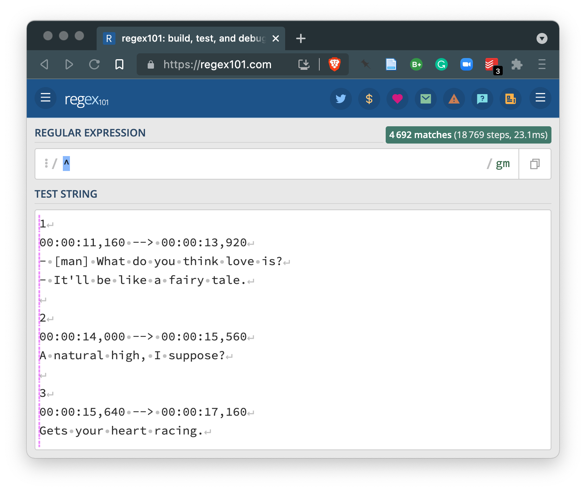
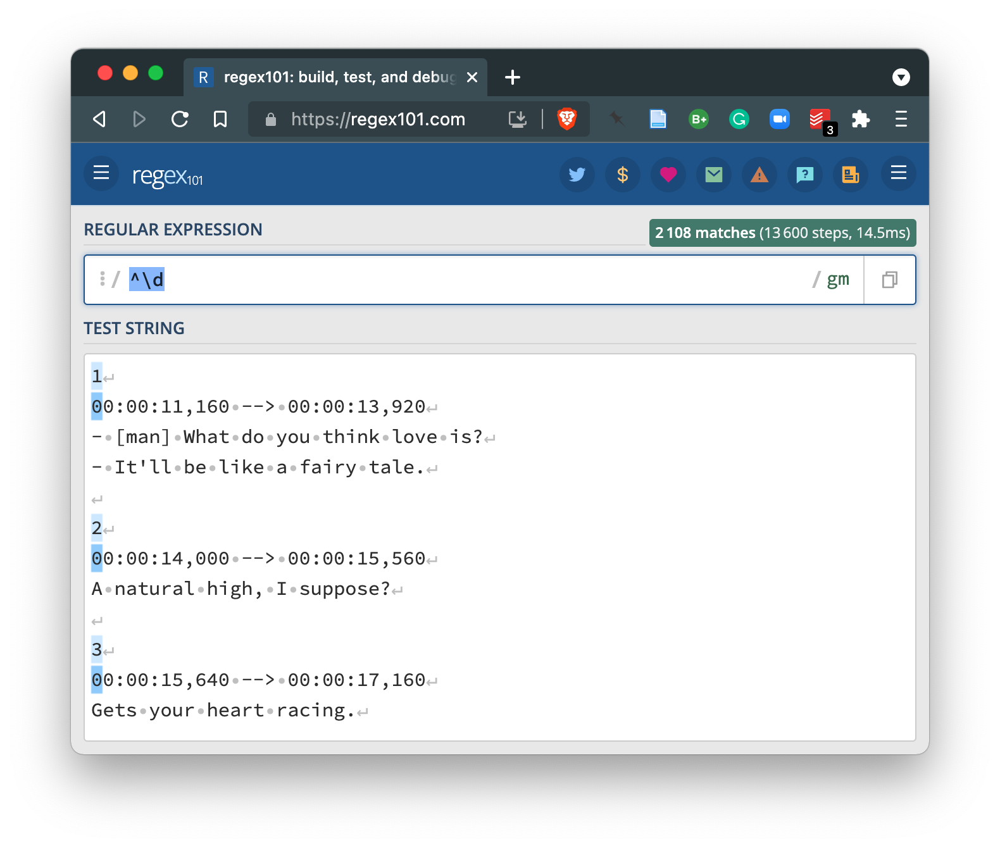
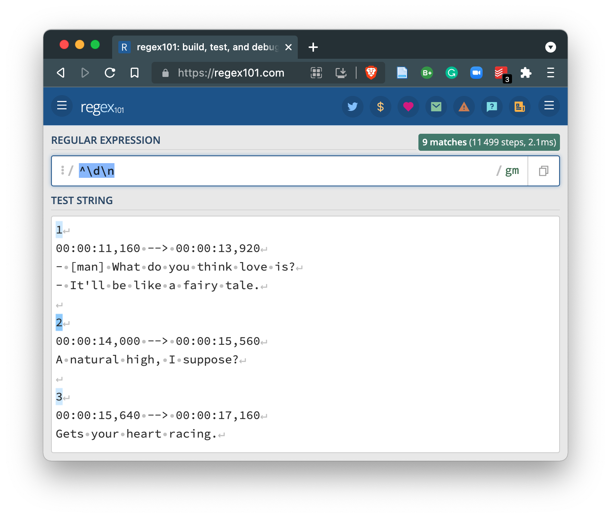
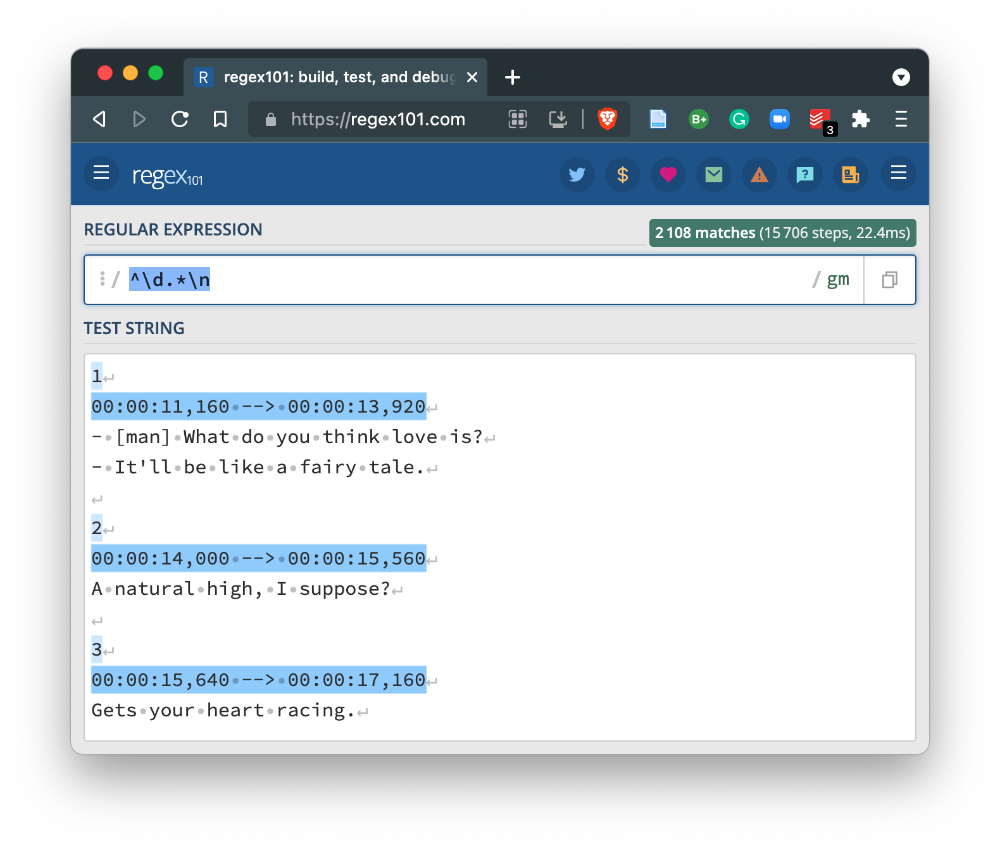

```{r, child="_common.Rmd"}
```

<!-- Outline:


NOTE:

- Addin: https://github.com/gadenbuie/regexplain for building/ understanding regular expressions

-->

## Overview 

In this Recipe, we will will take a closer look at a couple coding strategies that are quite applicable for just about any stage of a text analysis project, but that make particular sense for curating data. We will look at how regular expressions are helpful in developing strategies for matching, extracting, and/ or replacing patterns in character sequences and how to change the dimensions of a dataset to either expand or collapse columns or rows. 

As a practical case we will look at curating data from TV subtitles. We will use both regular expressions and strategies to reshape datasets. To get started let's load the main packages we will work with in this recipe.

```{r setup}
library(tidyverse) # data manipulation
library(readtext) # read files
library(tidytext) # text segmentation
```


## Coding strategies

### Regular expressions

It is often the case that when we are working with text that we will want to find, extract, and/ or replace characters or character sequences (strings) in our data or datasets. If the string patterns are extremely simple, we may only need to use 'literal' strings (the exact term you are searching for), such are used in typical searches you may perform on a word processing document, for example, that help you find all the occurrences of a string. In other cases, however, the string patterns are not so literal. That is to say that we may want to find some sort of meta-character string pattern such as any single digit, sequence of digits, words that begin with capital letters, the last words of a line, etc. In this case we cannot simple type a literal character sequence and match these patterns. However if there *is* a regular pattern and the string search syntax known as [regular expressions](https://en.wikipedia.org/wiki/Regular_expression) can help!

Take for example the following text:

```plain
1
00:00:11,160 --> 00:00:13,920
- [man] What do you think love is?
- It'll be like a fairy tale.

2
00:00:14,000 --> 00:00:15,560
A natural high, I suppose?

3
00:00:15,640 --> 00:00:17,160
Gets your heart racing.
```

This is small fragment of the contents from a subtitle file with [SRT (SubRip File Format)](https://docs.fileformat.com/video/srt/) formatting. As we are most likely interested in extracting the language from these sequences and removing the other formatting sequences, the question is how do we do this? Regular expressions!

A regular expression (or regex) is the use of various general pattern matching conventions to capture abstract, but regular patterns in strings. Below are some of the most common types of regex operators, grouped in terms of their function.

Classes

- `\w` any letter or digit character
- `\d` any digit character
- `\s` any whitespace character
- `.` any single character

Quantifiers

- `x?` zero or one of `x`
- `x*` zero or more of `x`
- `x+` one or more of `x`
- `x{2,}` two or more of `x`
- `x{5,10}` five to ten of `x`

Anchors

- `^` start of string
- `$` end of string
- `\b` word boundary
- `\n` new line

Escape

- `\` make any character class, quantifier, anchor, etc. literal

In this case, we want to "clean" the text by separating the non-linguistic information from the linguistic information. In the process of cleaning we may match a pattern to extract (or keep) or match to remove or replace. Looking at the text here, it looks like a good first step may be to match to remove. Specifically, let's see if we can match the lines that start with digits. 

Building a working regular expression requires some trial and error. To speed up the process, I tend to use an interactive regex website, [regex101](https://regex101.com/). I've opened this website and pasted the example text into the 'TEST STRING' field. 

Now let's work on building a regex for this example. Let's try adding the `^` operator to match the beginning of the lines.

```{r, echo=FALSE}

```

Nothing matched, but the regex101 site shows us with the pink vertical line that that's were the pattern matching is to begin.

Now let's add `\d` the digit operator. 

```{r, echo=FALSE}

```

We now see that the lines where there the first character is a digit are active and the first digit itself is highlighted. So far so good.

Comparing our active lines, we see that three of the six only have one digit and then end in a new line (`⏎`). If we add the `\n` operator to match a new line we get the following. 

```{r, echo=FALSE}

```

You can see that we lost the longer lines which contain various other characters before the end of the line. So we want to be able to capture the lines that start with digits that either have more characters before the end of the line the first digits and those without more characters. We can turn to the `.*` operator combination which will match any character (`.`) zero more more times (`*`). Inserting this between our existing expression provides the desired match. 

```{r, echo=FALSE}

```

So now we have a decent regex (`^\d.*\n`) that will match the lines we would like to remove from our example text. First let me read in the example text into a character vector where each line is an element in the vector. 

```{r example-text-read-lines}
example_text <- 
  read_lines(file = "recipe_7/data/original/love_on_the_spectrum/Love.On.The.Spectrum.S01E01.WEBRip.x264-ION10.srt", # path to the .srt file
             n_max = 12) # read only the first 12 lines

example_text # view character vector
```

`example_text` is the same text as above, but now each line from the file has been coverted into a separate vector. We can concatenate the vectors with a new line operator (`\n`) to show the text as it appears above.

```{r example-text-cat}
example_text %>% # character vector
  cat(sep = "\n") # concatenate the vectors adding a new line (\n) between each
```

Now let's put our regular expression to work. To do this we turn to the stringr package. Specifically the function `str_remove()` which has two arguments `string` and `pattern`. The string will be the `example_text` character vector and the pattern will be our regular expression (`^\d.*\n`) --with two twists. First, our `example_text` is broken into separate vectors by lines, so there are no more new line anchors (`\n`). Second, in R any `\` characters in regexes need to be escaped, that is they need an appended `\`. So our regex becomes `^\\d.*`.

```{r example-text-remove-regex}
example_text %>% # character vector
  str_remove(pattern = "^\\d.*") %>% # remove non-linguistic lines with regex
  cat(sep = "\n") # concatenate vectors
```

That works! Now there may be more to clean up, but this example should highlight the practicality of using regular expressions in text processing. Regular expressions are used in many ways across programming languages, including R, as well as in many desktop and web applications --so keep your eyes open for opportunities to use regexes!


### Reshaping data

Another key skill in which to acquire some proficiency is reshaping data. Reshaping here refers to changing the dimensions of a dataset --column-wise and/ or row-wise --to better fit the goals of the researcher.

#### Columns

Let's look at column-wise operations first. Consider the following single column data frame below.


```{r example-df-create, tidy=FALSE}
example_df <- 
  tribble(
    ~doc_id,
    "Love.On.The.Spectrum.S01E01",
    "Love.On.The.Spectrum.S01E02",
    "Love.On.The.Spectrum.S01E03"
  )

example_df # show data frame
```

In this example we have a data frame with a column `doc_id` with three observations. The observations for `doc_id` happen to contain various pieces of information that we would like to have in separate columns namely the title of a TV series, the season number, and the episode number. Let's shoot to get our dataset in the following column structure. 

```{r example-df-ideal, tidy=FALSE}
tribble(
  ~series, ~season, ~episode,
  "Love On The Spectrum", "01", "01",
  "Love On The Spectrum", "01", "02",
  "Love On The Spectrum", "01", "03"
)
```

To separate columns we use the `separate()` function from the tidyr package. It takes four main arguments, the dataset `data`, the column to separate `col`, the new column names to separate the columns into `into`, and the pattern to use to separate the values of the columns `sep`. In the single column table above we see that there is a period `.` that separates each word in the series title, but it also separates the title from the season and episode group. 

Let's apply `separate()` to create five new columns that correspond to the number of columns that will result on breaking the values by `.`. Since we need the period and not the 'any character' operator (`.`) from regular expressions, we need to escape the period `\\.` (Remember that in R all backslashes in regular expressions are escaped --therefore we have `\\.` and not `\.`). 

```{r example-df-cols-separate-1}
example_df %>% # example dataset
  separate(col = doc_id, # column to separate
           into = c("column_1", "column_2", "column_3", "column_4", "column_5"), # new column names
           sep = "\\.") # expression to separate the columns
```

We now have five columns, named generically for the moment. `column_5` contains the season and episode. But in this case there is not a clear character to use to break the column into two. But on closer inspection we can see that we can use the letter 'E' (for 'episode') to separate these values. It will mean that the 'E' will be eliminated, but that's OK because the column title will be sufficiently informative. 

```{r example-df-cols-separate-2}
example_df %>% # example dataset
  separate(col = doc_id, # column to separate
           into = c("column_1", "column_2", "column_3", "column_4", "column_5"), # new column names
           sep = "\\.") %>%  # expression to separate the columns
  separate(col = column_5, # column to separate
           into = c("season", "episode"),  # new column names
           sep = "E") # expression to separate the columns
```

Now the opposite of `separate()` is `unite()`. So this function will gather a set of columns and their values together. Let's unite the first four columns and call it `series` adding whitespace between each value (`sep = " "`).

```{r example-df-cols-unite}
example_df %>% # example dataset
  separate(col = doc_id, # column to separate
           into = c("column_1", "column_2", "column_3", "column_4", "column_5"), # new column names
           sep = "\\.") %>%  # expression to separate the columns
  separate(col = column_5, # column to separate
           into = c("season", "episode"),  # new column names
           sep = "E") %>%  # expression to separate the columns
  unite(col = "series", # new column name
        column_1:column_4, # columns to unite (using the between operator `:`)
        sep = " ") # separator to use to join the values of the columns
```

Just for completeness, let's use our newly acquired knowledge about regular expressions and remove the 'S' in the values of the `season` column.

```{r example-df-cols-clean}
example_df %>% # example dataset
  separate(col = doc_id, # column to separate
           into = c("column_1", "column_2", "column_3", "column_4", "column_5"), # new column names
           sep = "\\.") %>%  # expression to separate the columns
  separate(col = column_5, # column to separate
           into = c("season", "episode"),  # new column names
           sep = "E") %>%  # expression to separate the columns
  unite(col = "series", # new column name
        column_1:column_4, # columns to unite (using the between operator `:`)
        sep = " ") %>%  # separator to use to join the values of the columns
  mutate(season = str_remove(season, pattern = "^S")) # remove the S from the values of season
```

#### Rows


As you can imagine, there are occasions when we might want to change the the dimensions of a dataset by rows. Much in the same fashion as you saw in the previous section when we worked with expanding and collapsing columns, we can expand and collapse rows. This is a typical task to perform in text analysis on the linguistic units within a column and across rows at some linguistic level. 

Let's create an example data frame to work with to demonstrate various R programming strategies for expanding and collapsing rows with textual data.

```{r example-df-text, tidy=FALSE}
example_df <- 
  tribble(
    ~student_id, ~class_id, ~comments,
    "421", "A", "This class was fun! I would like to continue to work with my final essay and potentially turn in into an honors thesis. I will contact my professor to find out if this is possibility. Thanks!",
    "238", "B", "What shoud I say? I thought I was going to like the class but we did not get to do a final essay. I was hoping to develop a topic in this class that would help me work towards applying for an honors thesis."
  )

example_df
```

`example_df` has three columns. Two columns correspond to metadata and the third is text. The text includes a few sentences. So the observations, as they stand, correspond to each student's comments for a given class. If we would like to have our observations correspond to a smaller linguistic unit, say sentences, words, etc. we will want to expand the rows for each of the desired linguistic unit --while still maintaining the appropriate metadata information. 

An indispensable package for working with text in data frames is the tidytext package. The workhorse of the tidytext package is the `unnest_tokens()` function. This function allows us to separate rows in a column with text into rows corresponding to some smaller linguistic unit or 'token' while maintaining the tidy format of the overall dataset. 

Included with the `unnest_tokens()` function is the option to create a number of common token types (characters, words, ngrams, sentences, etc.) or one can specify the criterion manually using regular expressions. 

So let's apply `unnest_tokens()` to the `example_df` data frame. First let's look at breaking the `comments` column into sentences. 

```{r example-df-comments-sentences-1}
example_df %>% 
  unnest_tokens(output = "comment_sentences", # new column name
                input = "comments", # input column
                token = "sentences") # token type to create
```

We see that our data frame has been reshaped by rows --but importantly maintaining the metadata information! In this way our data frame continues to conform to tidy dataset principles.

Of note is the fact that by default `unnest_tokens()` will lowercase the text and drop the original/ input column. We can override one or both of these settings. 

```{r example-df-comments-sentences-2}
example_df %>% 
  unnest_tokens(output = "comment_sentences", # new column name
                input = "comments", # input column
                token = "sentences", # token type to create
                to_lower = FALSE, # don't lowercase the output
                drop = FALSE) # don't drop the input column
```

If we do not want to use one of the default token types, we can set the `token = ` to `regex` and then provide a new argument `pattern =`. The value for the `pattern` argument is your own regular expression. So say we wanted to break the `comments` by periods `.`, and not question marks or exclamation points, we could do this in this way. 

```{r example-df-comments-sentences-3}
example_df %>% 
  unnest_tokens(output = "comment_sentences", # new column name
                input = "comments", # input column
                token = "regex", # use a regular expression
                pattern = "\\.") # specify the regex to use for splitting
```

Note that since this approach uses a regular expression to do the splitting, the regex matches are deleted from the output (i.e. the periods are gone).

Let's turn to a situation in which our data frame has sentences as the observations. 

```{r example-df-comments-sentences-4}
example_df <- 
  example_df %>% 
  unnest_tokens(output = "comment_sentences", # new column name
                input = "comments", # input column
                token = "sentences", # token type to create
                to_lower = FALSE) # don't lowercase the output

example_df
```

And imagine that we want to collapse the sentences grouping them together by the `student_id` and the `class_id`, effectively re-creating the original data frame we started with. To do this we turn to our tidyverse tools. 

```{r example-df-comments}
example_df %>% # dataset with comment_sentences column
  group_by(student_id, class_id) %>% # group by student_id and class_id
  summarize(comments = str_flatten(string = comment_sentences, # unite comment_sentences
                                   collapse = " ")) %>%  # join comment_sentences by a single whitespace character
  ungroup() # remove grouping attribute on the data frame
```

`group_by()` specifies which column(s) should be used to unite the rows. `summarize()` is similar to `mutate()` in that it creates a new column. It is different, however, in that it will only return the grouping column(s) and the new column created by the operation contained within `summarize()`. In this case we applied the `str_flatten()` function, from the stringr package, to unite the `comment_sentences` column values. The `collapse = ` argument let's use specify what character(s) should be used to separate the united values.

## Case

So let's put these our regular expression and reshaping data skills to work in a practical example. In this case we will be looking at curating data from TV subtitles for the [Love on the Spectrum series](https://en.wikipedia.org/wiki/Love_on_the_Spectrum) which is a docuseries following the dating experiences of individuals on the Autism spectrum in Australia. 

The data was manually downloaed from [Opensubtitles.org](https://www.opensubtitles.org/en/search/subs) and the files we will use are SRT formatted, as seen below.

```plain
1
00:00:11,160 --> 00:00:13,920
- [man] What do you think love is?
- It'll be like a fairy tale.

2
00:00:14,000 --> 00:00:15,560
A natural high, I suppose?

3
00:00:15,640 --> 00:00:17,160
Gets your heart racing.
```

This format is used to display the subtitles at the correct moment on the screen so there is information which encodes the sequence of which subtitles to show, the actual timestamp duration which give the precise duration that the subtitle should show, and the text that is to be shown. This text may have conventions to display the text in particular ways and/ or signal cues for the hearing impaired (`[man]`, for example). 

We will first need to read these files into the R session. They are found in this directory structure: 

```bash
recipe_7/data/
├── derived/
└── original/
    └── love_on_the_spectrum/
        ├── Love.On.The.Spectrum.S01E01.WEBRip.x264-ION10.srt
        ├── Love.On.The.Spectrum.S01E02.WEBRip.x264-ION10.srt
        └── Love.On.The.Spectrum.S01E03.WEBRip.x264-ION10.srt
```

To read in the files I will use the `readtext()` function. The main argument is `file` which takes a path to the file(s). In this case I've added a wildcard `*` to allow for the reading of multiple files with the `.srt` extension. (Note: the `*` wildcard is not a regular expression convention but it does function much like the regex `.*`.) 

```{r lots-read-srt-files}
lots_files <- 
  readtext(file = "recipe_7/data/original/love_on_the_spectrum/*.srt", # only .srt files
           verbosity = 0) %>%  # suppress warnings
  as_tibble() # convert to a tibble for extended data frame features

glimpse(lots_files) # preview dataset
```

From the output of `glimpse()` we see that the structure of `lots_files` has two columns `doc_id` and `text` and three rows. 

### Curate metadata

Let's select just the `doc_id` column and look at the values. 

```{r lots-doc-id-view}
lots_files %>% 
  select(doc_id) # only show doc_id
```

We see that the names of each of the SRT files appears in the `doc_id` column. These names have a pattern, such that there is a period `.` separating each of a number of pieces of information --including the series name, the season, and the episode. Let's work separate this information into distinct columns effectively expanding the columns in the dataset. The idealized structure will look like the example below.

```{r lots-ideal-meta, echo=FALSE}
tribble(
  ~series, ~season, ~episode,
  "Love On The Spectrum", "01", "01",
  "Love On The Spectrum", "01", "02",
  "Love On The Spectrum", "01", "03"
)
```


Let's use the `separate()` function and apply it to the `doc_id` column. If we count up the number of columns that will be created by breaking the values in `doc_id` by the period `.` we will have eight columns. We only want to work with the first five, however. Knowing this we can set the argument `into` to a character vector with the names of five new columns. The `sep` argument is a period `\\.` and the extra columns (the remaining three of the eight) are set to be dropped (i.e. not included). 

```{r lots-separate-cols-1}
lots_files_separate <- 
  lots_files %>% # dataset
  separate(col = doc_id, # column to separate
           into = c("name_1", "name_2", "name_3", "name_4", "name_5"), # new column names
           sep = "\\.", # pattern to separate the column values
           extra = "drop") # drop any extra columns created in the separation

lots_files_separate %>% # separated dataset
  select(-text) # do not show the `text` column here
```
Now we have five new columns that were derived from the `doc_id` column. Note that the names for the columns were arbitrary. Since I know that we will be doing more changes to the columns I did not worry about creating meaningful column names.

The `name_5` column contans the season and episode information. We want to break this column up into two columns for each of these pieces of information. To do this we look at the values in `name_5` and see if there is some way to split/ separate the values that is consistent. It turns out we can use the 'E' for episode to separate the values between season and episode. 

```{r lots-separate-cols-2}
lots_files_separate <- 
  lots_files_separate  %>% # dataset
  separate(col = name_5, # column to separate
           into = c("season", "episode"), # new columns
           sep = "E") # pattern to use to separate the values

lots_files_separate %>% # separated dataset
  select(-text) # do not show the `text` column here
```

The new columns `season` and `episode` appear now. 

Let's now create the `series` column by uniting the first four columns (i.e. `name_1` through `name_4`). We can use the `unite()` function for this. `unite()` needs the name of the new column (`col`), a vector of the columns to unite (in this case `name_1:name_4`, which is equivalent to `c(name_1, name_2, name_3, name_4)`), and the separator for the new values (`sep`).

```{r lots-unite-cols}
lots_files_unite <- 
  lots_files_separate %>% # dataset
  unite(col = "series", # new column name
        name_1:name_4, # columns to unite
        sep = " ") # separator to add between of the column values

lots_files_unite %>% # united dataset
  select(-text) # do not show the `text` column here
```

The last thing to do is to clean up the `season` column values by removing the 'S' before each season number. We can just use the `str_remove()`. Notice that we use the `mutate()` function to modify columns, in this case we are going to modify the `season` column and then we are going to overwrite the existing `season` column with the results of `str_remove()`.

```{r lots-meta-curated}
lots_meta <- 
  lots_files_unite %>% # dataset
  mutate(season = str_remove(season, "S")) # remove 'S' in season and overwrite existing season column

glimpse(lots_meta) # preview full dataset
```

Great! We now have the metadata information curated as we aimed to do.

### Curate text

It's now time to turn our attention to working with the `text` column. Let's take a look at the first 500 characters in the first observation of the `text` column.

```{r lots-text-view, comment=""}
lots_meta$text[1] %>% # subset the first observation of the text column
  str_trunc(width = 500) %>% # truncate the values to 500 characters
  cat() # print the characters for inspection
```

What we see from the above output is that each row in the `text` column has the dialogue for each series, season, and episode in each row. We also see that this dialogue is not conducive to language research given the SRT formatting. Ideally we would like to clean this SRT information (sequence, timestamps, and other non-linguistic cues) and only retain the dialogue. 

So an idealized dataset for this data would look something like this: 

```{r lots-idealized-dataset, echo=FALSE}
tribble(
  ~series, ~season, ~episode, ~dialogue,
  "Love On The Spectrum", "01", "01", "It'll be like a fairy tale. A natural high, I suppose? Gets your heart racing. Can make people do crazy things. You just feel very warm inside yourself as a person. ...",
  "Love On The Spectrum", "01", "02", "I've never actually dated anyone in the past. I've been dreaming about marriage for years, ever since I left school. I do feel like I'm ready. ...",
  "Love On The Spectrum", "01", "03", "What do you think love is? It can make people do crazy things that they wouldn't think of doing, make them act all bizarre. ..."
)
```

So, before we get started we should think about how we could go about getting to this idealized format given the format of the text and the R programming strategies at our disposal. 

First, it is always a good idea to look at closely at the internal structure of the text. Looking at the text we can see that each observation in `text` has a series of lines, separated by `\n`. 

```{r lots-example-text-observation-trunc}
lots_files$text[1] %>% # first observation of the `text` column
  str_trunc(width = 200) # only show the first 200 characters
```

For the most part the distinct lines contain either dialogue or SRT conventions for displaying subtitles on a screen. So a potential first step to cleaning this data could be to split each observation into lines. We can do this by using the `unnest_tokens()` function and use a regular expression to separate by new line anchors `\\n`. 

```{r lots-separate-by-newlines}
lots_meta_lines <- 
  lots_meta %>% # dataset with `text` column
  unnest_tokens(output = lines, # new column
                input = text, # input column
                token = "regex", # use regular expression to split
                pattern = "\\n", # split by new line anchor
                to_lower = FALSE) # do not lowercase the text

lots_meta_lines %>% # dataset
  slice_head(n = 10) # preview first 10 observations
```

We can see from the first 10 observations that there is a consistent pattern in which the lines that start with a digit are not dialogue. It's worthwhile to open one or more of the original `.srt` files in a text editor (in RStudio or some other text editing software) to ensure this is the case.

On my inspection it does look like it is safe to target lines starting with digits to remove. Just as a sanity check, however, we can instead search for all the lines that start with digits and make sure that we do not get something that we would like to keep. 

To search for lines that start with digits, we can craft a regular expression to use with the `str_detect()` function. This will return a logical value, `TRUE` if there's a match, `FALSE` otherwise. Wrapping `str_detect()` with `filter()` will filter for only rows that return `TRUE`. 

```{r lots-lines-find-digits}
lots_meta_lines %>% # dataset
  filter(str_detect(lines, "^\\d")) %>% # detect lines starting with  a digit
  slice_sample(n = 10) # a random sample 10 observations from the entire dataset
```
Looks like this is a safe move. Let's go ahead and remove these lines. We could use `str_remove()` which would require that we match the entire pattern (line) we want to remove --or we can just leverage the search we just did and reverse the logical value to `FALSE` when it matches. Remember we can do this by adding the `!` operator in front of the `str_detect()` function as it returns a logical value.

```{r lots-lines-remove-digit-lines}
lots_meta_lines %>% # dataset
  filter(!str_detect(lines, "^\\d")) %>% # detect lines starting with a digit and remove them
  slice_head(n = 10) # first 10 observations
```
Great. Let's add to this code and continue to clean the text. The next aspect I we want to get rid of is the hyphens starting some lines. Let's get rid of these. To do this we *do* need to use `str_remove()` as we are just removing a portion of the line, namely the pattern captured by `^-\\s` (hyphens at the beginning of the line followed by a single whitespace).


```{r lots-lines-remove-hyphens}
lots_meta_lines %>% # dataset
  filter(!str_detect(lines, "^\\d")) %>% # detect lines starting with a digit and remove them
  mutate(lines = str_remove(lines, "^-\\s")) %>% # remove leading '- ' from each line
  slice_head(n = 10) # first 10 observations
```
Great. The '- ' leading each line are now gone.

Let's now explore what's going on with the lines that start with `[` which appear to include cues about who is speaking. In the cases we see in the first 10 observations we only see `[man]`, but let's search lines starting with `[` to find out if there are any other examples of this cue in the text. Since the `[` character means something in regular expressions we will need to escape it. So we will use the expression `^\\[`.


```{r lots-lines-search-bracket}
lots_meta_lines %>% # dataset
  filter(!str_detect(lines, "^\\d")) %>% # detect lines starting with a digit and remove them
  mutate(lines = str_remove(lines, "^-\\s")) %>% # remove leading '- ' from each line
  filter(str_detect(lines, "^\\[")) %>% # find lines starting with `[`
  slice_sample(n = 10) # random sample of 10 observations
```
Running the above code a couple of times in R Markdown, I get different samples of lines starting with `[`. From these results it seems like the brackets are used at the beginning of lines to signal a few types of cues. Most of them we want to remove --but we don't want to remove those where there are proper names. These names have a capital letter just inside the `[`. Let's use a regular expression to filter lines out that start with `[` followed by a lowercase letter. This regular expression is `^\\[[a-z]`. 

```{r lots-lines-filter-bracket}
lots_meta_lines %>% # dataset
  filter(!str_detect(lines, "^\\d")) %>% # detect lines starting with a digit and remove them
  mutate(lines = str_remove(lines, "^-\\s")) %>% # remove leading '- ' from each line
  filter(!str_detect(lines, "^\\[[a-z]")) %>% # remove lines starting with `[` before a lowercase letter
  slice_sample(n = 10) # random sample of 10 observations
```
Now that we have removed lines that were clearly marked as cues that were not dialogue from the speakers we are interested in, we can now remove any other cases where there is text inside brackets, `[David laughs]` for example. Let's try to search and *extract* this pattern. To isolate this pattern and only return the match we will use the `str_extract()` function. This will match a regular expression pattern and return only the complete match. To be able to evaluate whether this pattern is working I will use `mutate()` to assign the matches to a new column variable for easier comparison with the original text in the `lines` column.

Let's start with the pattern `\\[.+\\]`

```{r lots-lines-search-bracket-cues}
lots_meta_lines %>% # dataset
  filter(!str_detect(lines, "^\\d")) %>% # detect lines starting with a digit and remove them
  mutate(lines = str_remove(lines, "^-\\s")) %>% # remove leading '- ' from each line
  filter(!str_detect(lines, "^\\[[a-z]")) %>% # remove lines starting with `[` before a lowercase letter
  mutate(match = str_extract(lines, "\\[.+\\]")) %>% # search for cues inside of brackets ex. [man]
  slice_sample(n = 10) # random sample of 10 observations
```
The `\\[.+\\]` regex appears to do what we want, so now let's apply it to remove these cues. In this case again will use `str_remove()` because we are removing characters within a line, not the entire line. But since there may be more than one instance of the pattern in a single line, we will use the `str_remove_all()` function. 

```{r lots-lines-remove-bracket-cues}
lots_meta_lines %>% # dataset
  filter(!str_detect(lines, "^\\d")) %>% # detect lines starting with a digit and remove them
  mutate(lines = str_remove(lines, "^-\\s")) %>% # remove leading '- ' from each line
  filter(!str_detect(lines, "^\\[[a-z]")) %>% # remove lines starting with `[` before a lowercase letter
  mutate(lines = str_remove_all(lines, "\\[.+\\]")) %>% # remove cues inside of brackets ex. [man]
  slice_sample(n = 10) # random sample of 10 observations
```
The text in `lines` is looking pretty clean. Let's check to see if there are any other patterns that might signal artifacts that we might want to eliminate from the dialogue. Let's see if there are any lines that start with non-alphabetic or non-digit characters. We can accomplish this with the `^\\W` expression.


```{r lots-lines-search-non-word-chars}
lots_meta_lines %>% # dataset
  filter(!str_detect(lines, "^\\d")) %>% # detect lines starting with a digit and remove them
  mutate(lines = str_remove(lines, "^-\\s")) %>% # remove leading '- ' from each line
  filter(!str_detect(lines, "^\\[[a-z]")) %>% # remove lines starting with `[` before a lowercase letter
  mutate(lines = str_remove_all(lines, "\\[.+\\]")) %>% # remove cues inside of brackets ex. [man]
  filter(str_detect(lines, "^\\W")) %>% # search lines starting with non-word character
  slice_sample(n = 10) # random sample of 10 observations
```
Running the above code a few times to get a sample of what the `^\\W` pattern matches we get results which are clearly artifacts ('\<i\>') and some other which do not 'Yes.'. So let's play it safe and not filter by non-word character, but instead remove lines that start what appear to be HTML tags '\<tag\>'. The regular expression I've worked out for this is `^<.+?>.*`.

```{r lots-lines-remove-html-starts}
lots_meta_lines %>% # dataset
  filter(!str_detect(lines, "^\\d")) %>% # detect lines starting with a digit and remove them
  mutate(lines = str_remove(lines, "^-\\s")) %>% # remove leading '- ' from each line
  filter(!str_detect(lines, "^\\[[a-z]")) %>% # remove lines starting with `[` before a lowercase letter
  mutate(lines = str_remove_all(lines, "\\[.+\\]")) %>% # remove cues inside of brackets ex. [man]
  filter(!str_detect(lines, "^<.+?>.*")) %>% # remove lines starting with HTML tags
  slice_sample(n = 10) # random sample of 10 observations
```

Alright. This text is almost as clean as it's going to get. I did notice on inspection that there were '\<i\>...\</i\>' tags around some words, but they were words used by the target speakers. So let's keep the text inside but remove the leading and trailing tag with this expression `<.+?>`.

```{r lots-lines-remove-html-tags}
lots_meta_lines %>% # dataset
  filter(!str_detect(lines, "^\\d")) %>% # detect lines starting with a digit and remove them
  mutate(lines = str_remove(lines, "^-\\s")) %>% # remove leading '- ' from each line
  filter(!str_detect(lines, "^\\[[a-z]")) %>% # remove lines starting with `[` before a lowercase letter
  mutate(lines = str_remove_all(lines, "\\[.+\\]")) %>% # remove cues inside of brackets ex. [man]
  filter(!str_detect(lines, "^<.+?>.*")) %>% # remove lines starting with HTML tags
  mutate(lines = str_remove_all(lines, "<.+?>")) %>%  # remove all HTML tags
  slice_sample(n = 10) # random sample of 10 observations
```
Now we can assign the work we have done step-by-step to clean the data to a new data frame `lots_meta_lines_clean`. 


```{r lots-meta-lines-clean}
lots_meta_lines_clean <- 
  lots_meta_lines %>% # dataset
  filter(!str_detect(lines, "^\\d")) %>% # detect lines starting with a digit and remove them
  mutate(lines = str_remove(lines, "^-\\s")) %>% # remove leading '- ' from each line
  filter(!str_detect(lines, "^\\[[a-z]")) %>% # remove lines starting with `[` before a lowercase letter
  mutate(lines = str_remove_all(lines, "\\[.+\\]")) %>% # remove cues inside of brackets ex. [man]
  filter(!str_detect(lines, "^<.+?>.*")) %>% # remove lines starting with HTML tags
  mutate(lines = str_remove_all(lines, "<.+?>"))  # remove all HTML tags
```

The final step to curate this data into the structure we had idealized is to collapse the `lines` column into `dialogue` grouping by `series`, `season`, and `episode`. 

```{r lots-curated, message=FALSE}
lots_curated <- 
  lots_meta_lines_clean %>% # dataset
  group_by(series, season, episode) %>% # grouping
  summarise(dialogue = str_flatten(lines, collapse = " ")) %>% # collapse lines single observations for each series, season, episode combination
  ungroup() %>% # remove grouping attributes
  mutate(dialogue = str_trim(dialogue, side = "both")) # trim any leading or trailing whitespace from the united/ flattened lines in dialogue
```

So here's how the dataset looks now, with `dialogue` truncated to 200 characters for display here only.

```{r lots-curated-view}
lots_curated %>% # curated dataset
  mutate(dialogue = str_trunc(dialogue, 200)) # just show first 200 characters of dialogue
```

### Write and document

The last things to do are to write the curated dataset `lots_curated` to disk and to create a data dictionary. 

```{r lots-curated-write}
fs::dir_create(path = "recipe_7/data/derived/love_on_the_spectrum/")
write_csv(lots_curated, # curated dataset
          file = "recipe_7/data/derived/love_on_the_spectrum/lots_curated.csv")
```

I'm going to add the function described in the [Text as Data coursebook](https://lin380.github.io/coursebook/curate-data.html#documentation-2). 

```{r data-dic-starter-function}
data_dic_starter <- function(data, file_path) {
  # Function:
  # Creates a .csv file with the basic information
  # to document a curated dataset
  
  tibble(variable_name = names(data), # column with existing variable names 
       name = "", # column for human-readable names
       description = "") %>% # column for prose description
  write_csv(file = file_path) # write to disk
}
```

Now I'm going to call the `data_dic_starter()` on the `lots_curated` dataset and then open the file in a spreadsheet software and add human-readable variable names and descriptions for each file. 

```{r lots-data-dictionary-create}
data_dic_starter(data = lots_curated, # curated dataset
                 file_path = "recipe_7/data/derived/love_on_the_spectrum/lots_curated_data_dictionary.csv")
```

```bash
recipe_7/data/
├── derived/
│   └── love_on_the_spectrum/
│       ├── lots_curated.csv
│       └── lots_curated_data_dictionary.csv
└── original/
    └── love_on_the_spectrum/
        ├── Love.On.The.Spectrum.S01E01.WEBRip.x264-ION10.srt
        ├── Love.On.The.Spectrum.S01E02.WEBRip.x264-ION10.srt
        └── Love.On.The.Spectrum.S01E03.WEBRip.x264-ION10.srt
```

To summarize this quite long case, I've included a more concise form of the code to curate the Love on the Spectrum SRT files. 

```{r lots-summary-code, eval=FALSE}
# Read the SRT files
lots_files <- 
  readtext(file = "recipe_7/data/original/love_on_the_spectrum/*.srt", # only .srt files
           verbosity = 0) %>%  # suppress warnings
  as_tibble() # convert to a tibble for extended data frame features

# Curate metadata
lots_meta <- 
  lots_files %>% # dataset
  separate(col = doc_id, # column to separate
           into = c("name_1", "name_2", "name_3", "name_4", "name_5"), # new column names
           sep = "\\.", # pattern to separate the column values
           extra = "drop") %>%  # drop any extra columns created in the separation
  separate(col = name_5, # column to separate
           into = c("season", "episode"), # new columns
           sep = "E") %>%  # pattern to use to separate the values
  unite(col = "series", # new column name
        name_1:name_4, # columns to unite
        sep = " ") %>%  # separator to add between of the column values
  mutate(season = str_remove(season, "S")) # remove 'S' in season and overwrite existing season column

# Curate text
# Clean text by lines
lots_meta_lines <- 
  lots_meta %>% # dataset with `text` column
  unnest_tokens(output = lines, # new column
                input = text, # input column
                token = "regex", # use regular expression to split
                pattern = "\\n", # split by new line anchor
                to_lower = FALSE) %>% # do not lowercase the text
  filter(!str_detect(lines, "^\\d")) %>% # detect lines starting with a digit and remove them
  mutate(lines = str_remove(lines, "^-\\s")) %>% # remove leading '- ' from each line
  filter(!str_detect(lines, "^\\[[a-z]")) %>% # remove lines starting with `[` before a lowercase letter
  mutate(lines = str_remove_all(lines, "\\[.+\\]")) %>% # remove cues inside of brackets ex. [man]
  filter(!str_detect(lines, "^<.+?>.*")) %>% # remove lines starting with HTML tags
  mutate(lines = str_remove_all(lines, "<.+?>"))  # remove all HTML tags

# Collapse lines by series, season, and episode
lots_curated <- 
  lots_meta_lines %>% 
  group_by(series, season, episode) %>% # grouping
  summarise(dialogue = str_flatten(lines, collapse = " ")) %>% # collapse lines single observations for each series, season, episode combination
  ungroup() %>% # remove grouping attributes
  mutate(dialogue = str_trim(dialogue, side = "both")) # trim any leading or trailing whitespace from the united/ flattened lines in dialogue

# Write the dataset to disk
fs::dir_create(path = "recipe_7/data/derived/love_on_the_spectrum/")
write_csv(lots_curated, # curated dataset
          file = "recipe_7/data/derived/love_on_the_spectrum/lots_curated.csv")

# Create data dictionary to open and edit
data_dic_starter <- function(data, file_path) {
  # Function:
  # Creates a .csv file with the basic information
  # to document a curated dataset
  
  tibble(variable_name = names(data), # column with existing variable names 
       name = "", # column for human-readable names
       description = "") %>% # column for prose description
  write_csv(file = file_path) # write to disk
}

data_dic_starter(data = lots_curated, 
                 file_path = "recipe_7/data/derived/love_on_the_spectrum/lots_curated_data_dictionary.csv")
```

Wow! That was quite the journey.


## Summary

In this Recipe we, again, covered a lot of ground. Key programming strategies that were included were regular expressions and reshaping data. In the process we reviewed and extended the use of many functions from the tidyverse meta-package and also included a very powerful function `unnest_tokens()` from the tidytext package. We will continue to work with these principles and packages in the next recipe when we move to refine our curated dataset to align directly with our analysis method.
